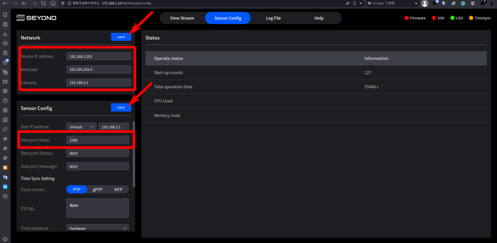
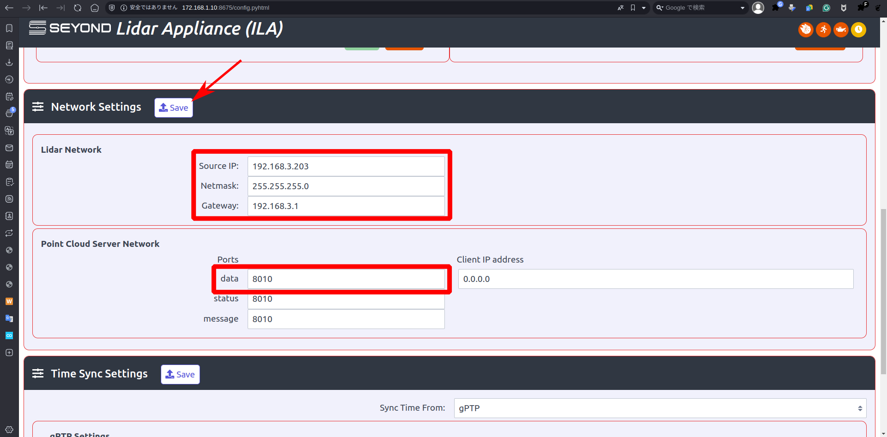

DRS setup on Anvil
---
- [Instruction](#instruction)
  - [Base system setup](#base-system-setup)
  - [Camera driver installation](#camera-driver-installation)
  - [Build ROS environment](#build-ros-environment)
  - [Network configuration](#network-configuration)
  - [Sensor configuration](#sensor-configuration)
    - [LiDAR](#lidar)
    - [INS](#ins)
  - [NAS configuration](#nas-configuration)
- [Related articles](#related-articles)

# Instruction
## Base system setup
1. Flash Anvil
   1. Confirm that BSP version is r35.4.1 (as of Jun 24, 2024)
        ```shell
        $ cat /etc/nv_tegra_release
        # R35 (release), REVISION: 4.1, GCID: 33958178, BOARD: t186ref, EABI: aarch64, DATE: Tue Aug  1 19:57:35 UTC 2023
        ```
   2. If BSP version is different, flash Anvil
      - refer: [CTI Anvil: How to clean install](https://tier4.atlassian.net/wiki/spaces/CT/pages/3058303576). The flash step also can be found in the release note for each BSP
> [!Note]
> For BSP version, use r35.4.1 (as of `Jun 24, 2024`)

2. Initial setup befor building ROS environment
   1. `sudo apt update`
   2. Create systemd service to run `jetson_clocks` on every boot
      - Copy and paste the following into the `/etc/systemd/system/jetson_clocks.service`
        ```ini
        [Unit]
        Description=Maximize Jetson Performance
        After=multi-user.target
        [Service]
        ExecStart=/usr/bin/jetson_clocks
        [Install]
        WantedBy=multi-user.target
        ```
      - Enable service: `sudo systemctl enable jetson_clocks.service`
   3. Set power mode to maximize performance
        ```shell
        sudo nvpmodel -m 0
        ```
        (Because this command makes the configuration persistent, you need do this only once)
   4. [Optional] install `jstat`
        ```shell
        sudo apt install python3-pip
        sudo pip3 install -U jetson-stats
        ```

## Camera driver installation
1. Download a package from [anvil](https://drive.google.com/drive/folders/1YzFfKuYTyMHDtp8nukx_9eopVQJvDU6U)

> [!Note]
> As of Jun 24, 2024 , the latest version is v6

> [!IMPORTANT] 
> tar.gz must be provided from TIER IV 

2. Extract
    ```shell
    tar zxvf tier4-camera-drivers-for-anvil-v6.tar.gz
    cd tier4-camera-drivers-for-anvil/
    ```
3. Modify the install.sh and execute it to disable built-in driver
    ```patch
    --- /tmp/install.sh.before      2024-06-23 16:53:27.546417590 +0900
    +++ ./install.sh        2024-06-23 17:04:54.782589989 +0900
    @@ -30,7 +30,7 @@
    ln -s /usr/src/linux-cti-anvil-t4/sources/kernel/kernel-5.10/ /lib/modules/5.10.120-tegra-t4/build
    
    echo "[*] Installing the TIER IV camera drivers package..."
    -apt install --no-install-recommends ./camera_GMSL2_driver/tier4-camera-gmsl_${DRIVER_VERSION}_arm64.deb
    +# apt install --no-install-recommends ./camera_GMSL2_driver/tier4-camera-gmsl_${DRIVER_VERSION}_arm64.deb
    dkms remove tier4-camera-gmsl/$DRIVER_VERSION --all || true
    
    echo "[*] Installing configuration files..."
    @@ -43,8 +43,8 @@
    echo "[*] bootloader: making 't4_primary' the default entry"
    sed -i -e 's/^DEFAULT .*$/DEFAULT t4_primary/' /boot/extlinux/extlinux.conf
    
    -echo "[*] Now you can run config-by-hardware.py to enable TIER IV cameras"
    -/opt/nvidia/jetson-io/config-by-hardware.py -l
    +# echo "[*] Now you can run config-by-hardware.py to enable TIER IV cameras"
    +# /opt/nvidia/jetson-io/config-by-hardware.py -l
    
    set +eux
    ```
    ```shell
    sudo ./install.sh
    sudo reboot
    ```

4. Install C3 supported camera driver 
    > [!IMPORTANT]
    > driver package must be provided from TIER IV
    ```shell
    # git clone git@github.com:tier4/camera_GMSL2_driver.git -b feature/c3-release
    git clone git@github.com:tier4/camera_GMSL2_driver.git -b feature/c2-isp-ldc-fix
    cd camera_GMSL2_driver/drivers
    sudo apt install make build-essential debhelper debmake devscripts dkms
    ./create_deb_pkg.sh
    # cd ../ && sudo apt install ./tier4-camera-gmsl_1.4.4_arm64.deb
    cd ../ && sudo apt install ./tier4-camera-gmsl_1.5.0_arm64.deb
    ```

5. Configure the driver
   <!-- 1. Fix the GMSL2 port assing to: (1|2) = C1, (3|4) = C2, (5|6|7|8) = C3  -->
   1. Fix the GMSL2 port assign to: (1|2|3|4|5|6|7|8) = C2
        ```shell
        # sudo /opt/nvidia/jetson-io/config-by-hardware.py -n 1="TIERIV GMSL2 Camera Device Tree Overlay: C1x2 C2x2 C3x4"
        sudo /opt/nvidia/jetson-io/config-by-hardware.py -n 1="TIERIV GMSL2 Camera Device Tree Overlay: C2x8" 
        ```

   2. Set C2 to fsync 20fps mode
        ```patch
        --- ./drivers/debian/etc/modprobe.d/tier4-imx490.conf   2024-06-23 17:06:48.959220109 +0900
        +++ /etc/modprobe.d/tier4-imx490.conf   2024-06-23 17:21:32.095938250 +0900
        @@ -15,7 +15,7 @@
        # "enable_distortion_correction=1" enable distortion correction feature.(Default)
        #
        
        -options tier4_imx490 trigger_mode=0 enable_auto_exposure=1 enable_distortion_correction=1
        +options tier4_imx490 trigger_mode=3 enable_auto_exposure=1 enable_distortion_correction=0 shutter_time_min=11000 shutter_time_max=11000 fsync_mfp=7
        ```
   3. Set C3 to fsync 20fps mode
        ```patch
        --- ./drivers/debian/etc/modprobe.d/tier4-imx728.conf   2024-06-23 17:06:48.959220109 +0900
        +++ /etc/modprobe.d/tier4-imx728.conf   2024-06-23 17:22:52.968366628 +0900
        @@ -15,7 +15,7 @@
        # "enable_distortion_correction=1" enable distortion correction feature.(Default)
        #
        
        -options tier4_imx728 trigger_mode=0 enable_auto_exposure=1 enable_distortion_correction=1
        +options tier4_imx728 trigger_mode=3 enable_auto_exposure=1 enable_distortion_correction=0 shutter_time_min=11000 shutter_time_max=11000 fsync_mfp=7
        ```
6. Update the contents of  `/lib/udev/rules.d/99-tier4-camera-gmsl.rules` as follows:
    ```conf
    SUBSYSTEM=="video4linux", ATTR{name}=="vi-output, tier4_imx728 40-003b", SYMLINK+= "gmsl/tier4-imx728-cam8"
    SUBSYSTEM=="video4linux", ATTR{name}=="vi-output, tier4_imx490 40-002b", SYMLINK+= "gmsl/tier4-imx490-cam8"
    SUBSYSTEM=="video4linux", ATTR{name}=="vi-output, tier4_isx021 40-001b", SYMLINK+= "gmsl/tier4-isx021-cam8"
    SUBSYSTEM=="video4linux", ATTR{name}=="vi-output, tier4_imx728 40-003c", SYMLINK+= "gmsl/tier4-imx728-cam7"
    SUBSYSTEM=="video4linux", ATTR{name}=="vi-output, tier4_imx490 40-002c", SYMLINK+= "gmsl/tier4-imx490-cam7"
    SUBSYSTEM=="video4linux", ATTR{name}=="vi-output, tier4_isx021 40-001c", SYMLINK+= "gmsl/tier4-isx021-cam7"
    SUBSYSTEM=="video4linux", ATTR{name}=="vi-output, tier4_imx728 41-003b", SYMLINK+= "gmsl/tier4-imx728-cam6"
    SUBSYSTEM=="video4linux", ATTR{name}=="vi-output, tier4_imx490 41-002b", SYMLINK+= "gmsl/tier4-imx490-cam6"
    SUBSYSTEM=="video4linux", ATTR{name}=="vi-output, tier4_isx021 41-001b", SYMLINK+= "gmsl/tier4-isx021-cam6"
    SUBSYSTEM=="video4linux", ATTR{name}=="vi-output, tier4_imx728 41-003c", SYMLINK+= "gmsl/tier4-imx728-cam5"
    SUBSYSTEM=="video4linux", ATTR{name}=="vi-output, tier4_imx490 41-002c", SYMLINK+= "gmsl/tier4-imx490-cam5"
    SUBSYSTEM=="video4linux", ATTR{name}=="vi-output, tier4_isx021 41-001c", SYMLINK+= "gmsl/tier4-isx021-cam5"
    SUBSYSTEM=="video4linux", ATTR{name}=="vi-output, tier4_imx728 42-003b", SYMLINK+= "gmsl/tier4-imx728-cam4"
    SUBSYSTEM=="video4linux", ATTR{name}=="vi-output, tier4_imx490 42-002b", SYMLINK+= "gmsl/tier4-imx490-cam4"
    SUBSYSTEM=="video4linux", ATTR{name}=="vi-output, tier4_isx021 42-001b", SYMLINK+= "gmsl/tier4-isx021-cam4"
    SUBSYSTEM=="video4linux", ATTR{name}=="vi-output, tier4_imx728 42-003c", SYMLINK+= "gmsl/tier4-imx728-cam3"
    SUBSYSTEM=="video4linux", ATTR{name}=="vi-output, tier4_imx490 42-002c", SYMLINK+= "gmsl/tier4-imx490-cam3"
    SUBSYSTEM=="video4linux", ATTR{name}=="vi-output, tier4_isx021 42-001c", SYMLINK+= "gmsl/tier4-isx021-cam3"
    SUBSYSTEM=="video4linux", ATTR{name}=="vi-output, tier4_imx728 43-003b", SYMLINK+= "gmsl/tier4-imx728-cam2"
    SUBSYSTEM=="video4linux", ATTR{name}=="vi-output, tier4_imx490 43-002b", SYMLINK+= "gmsl/tier4-imx490-cam2"
    SUBSYSTEM=="video4linux", ATTR{name}=="vi-output, tier4_isx021 43-001b", SYMLINK+= "gmsl/tier4-isx021-cam2"
    SUBSYSTEM=="video4linux", ATTR{name}=="vi-output, tier4_imx728 43-003c", SYMLINK+= "gmsl/tier4-imx728-cam1"
    SUBSYSTEM=="video4linux", ATTR{name}=="vi-output, tier4_imx490 43-002c", SYMLINK+= "gmsl/tier4-imx490-cam1"
    SUBSYSTEM=="video4linux", ATTR{name}=="vi-output, tier4_isx021 43-001c", SYMLINK+= "gmsl/tier4-isx021-cam1"
    ```
7. **reboot**
8. Build the camera driver using the new kernel
    ```shell
    # sudo dkms remove tier4-camera-gmsl/1.4.4 -k `uname -r`
    # sudo dkms install tier4-camera-gmsl/1.4.4 -k `uname -r`
    sudo dkms remove tier4-camera-gmsl/1.5.0 -k `uname -r`
    sudo dkms install tier4-camera-gmsl/1.5.0 -k `uname -r`
    ```
9. Change Linux kernel to be used by modifying /boot/extlinux/extlinux.conf
    ```patch
    --- extlinux.conf.before        2024-08-08 14:19:35.205005209 +0900
    +++ extlinux.conf.after 2024-08-08 14:20:17.249092014 +0900
    @@ -40,7 +40,7 @@
    
    LABEL JetsonIO
            MENU LABEL Custom Header Config: <CSI TIERIV GMSL2 Camera Device Tree Overlay: C2x8>
    -       LINUX /boot/Image-t4
    +       LINUX /boot/Image
            FDT /boot/tegra234-orin-agx-cti-AGX201-JCB002-base-user-custom.dtb
            INITRD /boot/initrd
            APPEND ${cbootargs} root=/dev/mmcblk0p1 rw rootwait rootfstype=ext4 mminit_loglevel=4 console=ttyTCU0,115200 console=ttyAMA0,115200 console=tty0 firmware_class.path=/etc/firmware fbcon=map:0 net.ifnames=0 nospectre_bhb
    ```
## Build ROS environment
see https://github.com/tier4/data_recording_system?tab=readme-ov-file#getting-started  for the latest information
```shell
cd
git clone git@github.com:tier4/data_recording_system.git
cd data_recording_system
./setup-dev-env.sh
```
```shell
vcs import src < autoware.repos
rosdep install -y -r --from-paths `colcon list --packages-up-to drs_launch simple_frontend -p` --ignore-src
python3 -m pip install gpiod==1.5.4  # Install additional dependency that rosdep can not handle
./build.sh
./setup-drs.sh
```
> [!Note]
> `setup-drs.sh` will show three dialogs to be filled:
> - ECU ID: the local ECU ID ( `0` or `1` ). Front and right facing sensor are connected to the ECU0, others are connected to the ECU1.
> - SENSING SYSTEM ID: this value will be acquired via CLI or provided from TIER IV
> - MODULE ID: this value will be acquired via CLI or provided from TIER IV


## Network configuration
To enable password-less ssh, type the following on ECU#0

```shell
# rsa key should be generated during `setup-drs.sh`
ssh-copy-id -i ${HOME}/.ssh/drs_rsa.pub nvidia@192.168.20.1 # register key to ECU#0 itself
ssh-copy-id -i ${HOME}/.ssh/drs_rsa.pub nvidia@192.168.20.2 # copy the key to ECU#1
ssh-copy-id -i ${HOME}/.ssh/drs_rsa.pub comlops@192.168.10.100 # copy teh key to NAS
```

## Sensor configuration
| Sensor Name      | Sensor IP to be set | Sensor data port to be set |
| :--------------- | :------------------ | :------------------------- |
| Falcon K (Front) | `192.168.2.201`     | 2368                       |
| Robin W (Right)  | `192.168.3.203`     | 8010                       |
| Falcon K (Rear)  | `192.168.2.202`     | 2369                       |
| Robin W (Left)   | `192.168.3.204`     | 8010                       |
| INS              | `192.168.4.250`     | N/A                        |

### LiDAR
Access `172.168.1.10:8675` (Default IP and port to provide web GUI interface running on the device) using a web browser, configure IP address and data port, and then reboot the device to apply the modification

- Seyond Falcon K (Front/Rear)
    
 
- Seyond Robin W (Left/Right)
    

### INS
> [!WARNING]
> This configuration uses application running on Windows OS

See [AV200の設定](https://docs.google.com/presentation/d/1JCK5UlOemPfUKJGgPXGNl--skfJwkuaZ67il8Kmyc_E/edit#slide=id.g3157a27436e_0_192)

## NAS configuration
See [DRS-NAS(QNAP)の設定](https://docs.google.com/presentation/d/1MjBWWuyWrQPvxsnwMA8kEqOR3hi0MxyAGsGCiyZgBfw/edit?usp=sharing)

# Related articles
- [DRS calibration](../calibration/index.md)
- [DRS sensor動作確認](https://tier4.atlassian.net/wiki/spaces/~621c20116a4c4c0070ac66d7/pages/3361604453/DRS+sensor)
