# Camera-LiDAR Extrinsic Calibration

This page describes the procedure for calibrating the relative pose between the camera and the LiDAR using an AprilTag board.

Tool reference: [tag_based_pnp_calibrator.md](https://github.com/tier4/CalibrationTools/blob/feat/drs/docs/tutorials/tag_based_pnp_calibrator.md)

> [!NOTE]
> This procedure assumes a specific ID and orientation for the AprilTag. Mount and orient the board as shown below:  
> 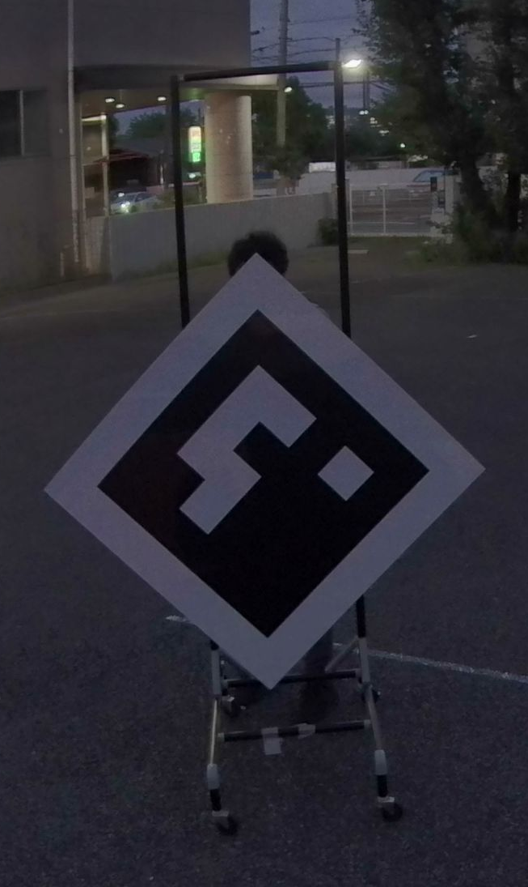

---

## 1. Preparation

### Hardware: GNSS/INS Disconnection
Before starting the calibration, disconnect the GNSS/INS LAN cable from **ecu0** to eliminate any potential influence from the GNSS/INS.

> [!NOTE]
> If the GNSS/INS is used for time synchronization, differences in how Leap Seconds are handled (depending on the configuration) may cause timestamp drifts between the LiDAR and the Camera, making it impossible to perform the calibration.

### ECU Side: Start Sensor Streams
Calibration requires sensor data without coordinate transformations (TF).

```bash
# SSH into BOTH ECU0 and ECU1
# example ECU0: ssh nvidia@192.168.20.1 
# example ECU1: ssh nvidia@192.168.20.2

# Stop DRS sensor services on BOTH ECUs
sudo systemctl stop drs-sensor.service
```

```bash
# On the ECU where target sensors are connected, start DRS services without TF
ros2 launch drs_launch drs.launch.xml publish_tf:=false param_root_dir:=/opt/drs/config/params
```

### PC Side: Launch Decoder & Tool
1.  **Launch Decoder (Runtime Container or Local Build Environment)**: Run the offline decoder to process sensor packets.
    ```bash
    ros2 launch drs_launch drs_offline.launch.xml publish_tf:=false
    ```

> [!NOTE]
> If you are using the Seyond LiDAR driver, add the argument `lidar_driver_type:=seyond` to the launch command.

2.  **Launch Tool (Calibration Container or Local Build Environment)**: Start the sensor calibration manager.
    ```bash
    ros2 run sensor_calibration_manager sensor_calibration_manager
    ```

---

## 2. Calibration Procedure

### Step 1: Initial Configuration
1.  **First Dialog**:
    - **Project**: `drs`
    - **Calibrator**: `tag_based_pnp_calibrator`
    - Click **Continue**.  
    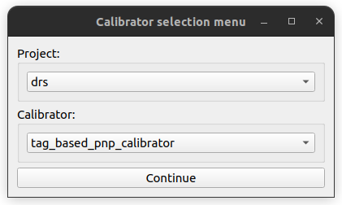

> [!NOTE]
> If you are using the Seyond LiDAR driver, select **Project**: `drs_seyond`.

2.  **Second Dialog**:
    - **Camera Name**: Select the target camera (e.g., `camera0`). The tool will automatically select the corresponding LiDAR.
    - Click **Launch**.  
    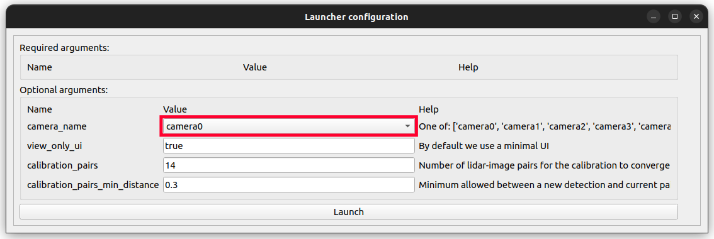

### Step 2: UI Setup and start calibration
Adjust the settings in the tool and RViz:

- **Calibration Tool/Image view**:
    - **TF source**: `Current /tf`
    - **Marker units**: `Pixels`  
    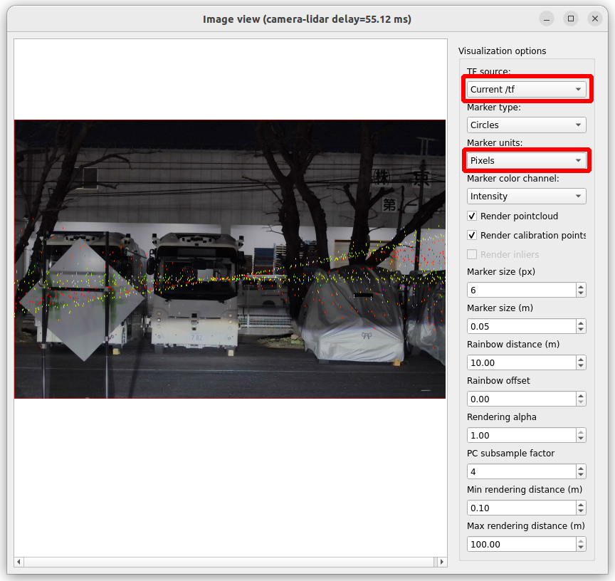
- **Calibration Tool/RViz2**:
    - **Fixed Frame**: Set to the appropriate LiDAR frame (e.g., `lidar_front`).  
    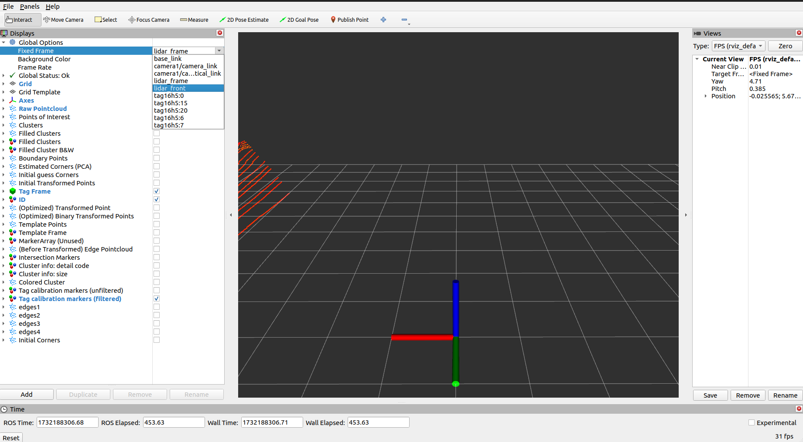
- **Calibration Tool/sensor_calibration_manager**:
    - Click **Calibrate**.  
    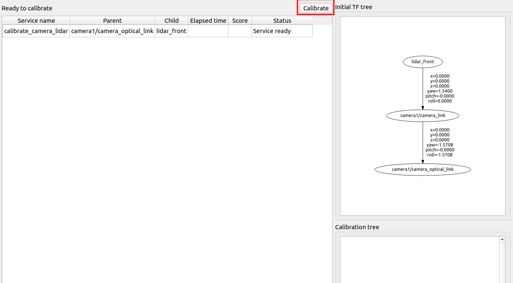
- **Calibration Tool/RViz2**:
    - Once the calibration process is triggered, status text will appear in the RViz window.  
    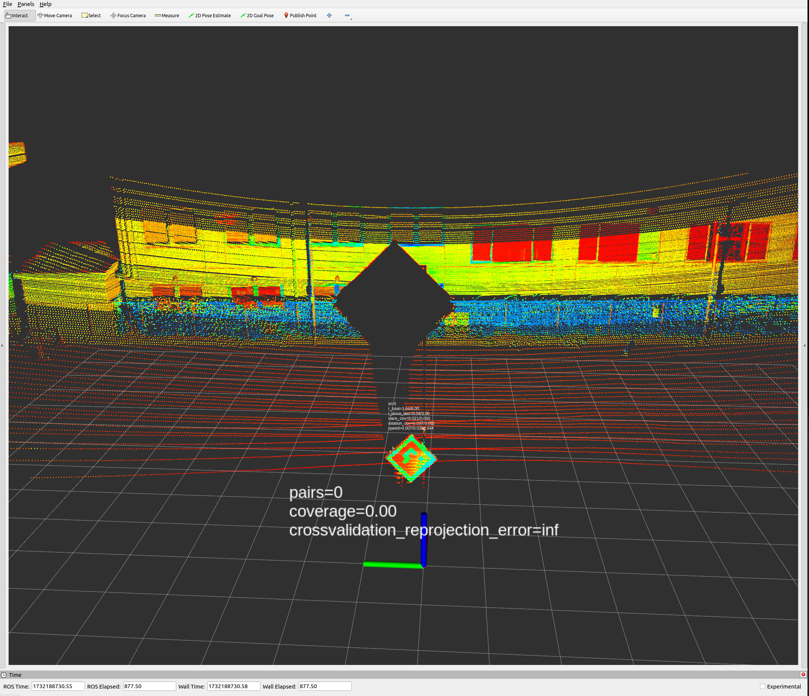

### Step 3: AprilTag Pair Collection
1.  Move the AprilTag board slowly within the sensor field of view. Move the board so that the location of detected pairs covers as wide an area of sensor FoV as possible.
2.  If the AprilTag is detected in both the LiDAR pointcloud and the camera image, the number of pairs increases. As the number of detected pairs increases, proper projection results will be displayed on the **Image view** window.  
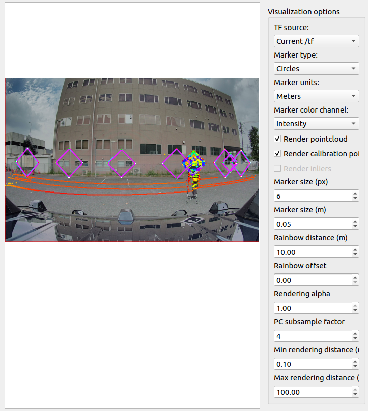
3.  Monitor the `crossvalidation_reprojection_error` in the tool. If this value gets extremely high (like over 10), there may be an issue (e.g., published `camera_info` is not the proper (calibrated) one).  
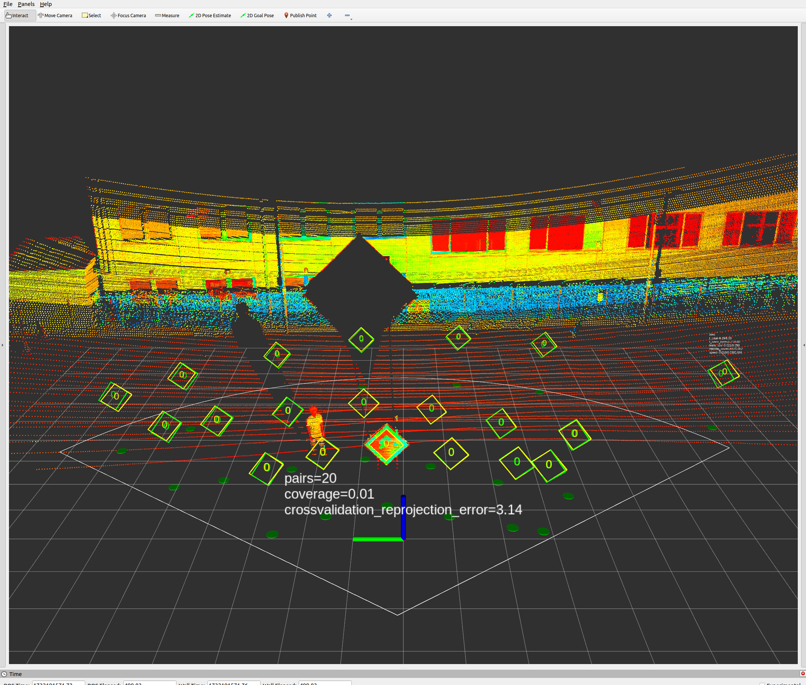
4.  **Completion Criteria**: When the number of detected pairs exceeds **14**, click **Save calibration**.  
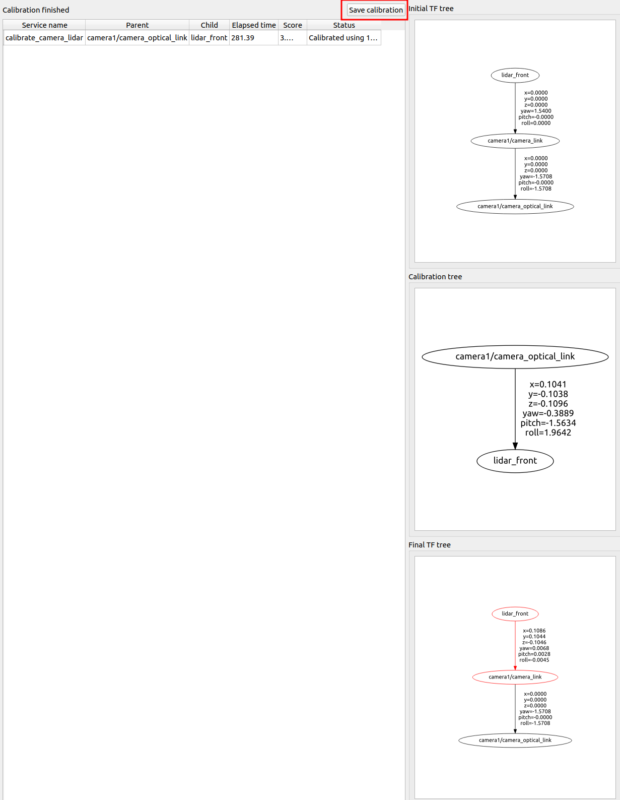
5.  **Rename Result**: Rename the generated file to `camera<N>_calibration_results.yaml`.

> [!NOTE]
> In a later step, these results will be used to create `multi_tf_static.yaml`. The expected directory structure for the results is as follows:
> ```text
> [temporary_directory]
> ├── camera0_calibration_results.yaml
> ├── camera1_calibration_results.yaml
> ├── camera2_calibration_results.yaml
> ├── camera3_calibration_results.yaml
> ├── camera4_calibration_results.yaml
> ├── camera5_calibration_results.yaml
> ├── camera6_calibration_results.yaml
> └── camera7_calibration_results.yaml
> ```

---

## 3. Troubleshooting

### No images in image_view
If the "delay" value in the UI is too high, the images may not display. This is often caused by time synchronization issues between the ECU and PC, camera and LiDAR.  
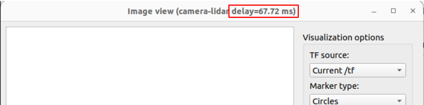

**Diagnostic Steps**:

1.  **Check Timestamp Offset**:
    Verify the timestamps of the target camera and LiDAR to check for synchronization gaps.
    ```bash
    # Check LiDAR timestamp
    ros2 topic echo /sensing/lidar/front/nebula_points --field header.stamp

    # Check Camera timestamp
    ros2 topic echo /sensing/camera/camera0/image_raw/compressed --field header.stamp
    ```

    > [!NOTE]
    > Replace the topic names in the commands above with those of your target camera and LiDAR.

2.  **Determine the Cause**:
    - **Offset >= 200ms**: There may be a major time synchronization issue within the DRS system.
        - **Check**: Verify the time synchronization status on the **DRS Dashboard**.
    - **Offset < 200ms**: This is likely a time synchronization issue between the ECU and the PC.
        - **Fix**: Relax the delay tolerance in the following file:
          `common/tier4_calibration_views/tier4_calibration_views/image_view_ros_interface.py`
          ```python
          # Change the default value from 0.06 to 1.06
          self.declare_parameter("delay_tolerance", 1.06)
          ```

---

### Pair count display does not appear in RViz after clicking "Calibrate"
Even after clicking the **Calibrate** button, the status text showing the number of pairs may not appear in the RViz window.

**Possible Cause**:
If the Calibration Tool has been launched and closed multiple times, some background processes may have failed to terminate correctly, interfering with the calibration process.

**Fix/Countermeasures**:
- Restart the PC to ensure all processes are correctly reset.

---

### AprilTag Not Detected
- Ensure the board is well-lit and not tilted at an extreme angle.
- If performing calibration outdoors, check for strong sunlight reflections on the board.
- Verify that there are no people or objects in the immediate vicinity of the AprilTag.
- Verify the LiDAR detects the board surface as a flat plane.

---
### Detection results are inconsistent or corrupted
If the AprilTag board is not stable (e.g., oscillating due to wind), the LiDAR may fail to detect the plane accurately, causing current results to contradict previous detections.  
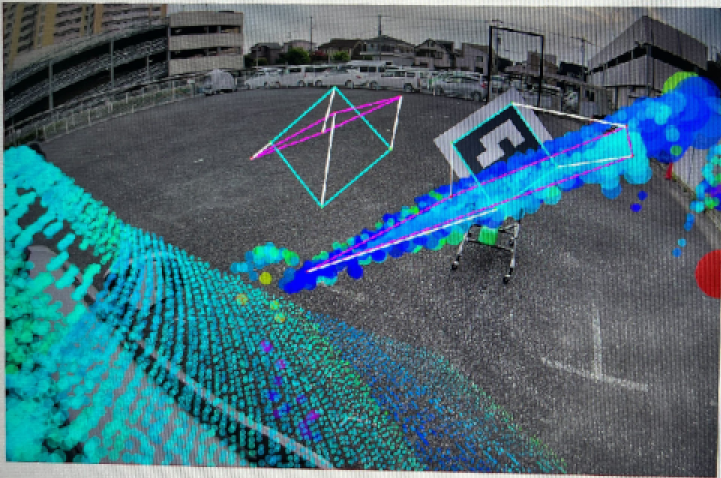

**Fix/Countermeasures**:
- **Ensure Stability**: Secure the AprilTag board firmly to prevent any movement.
- **Controlled Movement**: When moving the board between positions, turn the board so that its **back** is facing the sensors. This prevents the tool from capturing unstable data during movement.
- **Initial Pairs**: Collect the first **1 to 4 pairs** near the **center** of both the camera and LiDAR Field of View (FoV) to establish a stable baseline.

---

**Next Step**: [LiDAR-LiDAR calibration](lidar_calibration.md)