DRS calibration
===
- [DRS calibration](#drs-calibration)
- [Setup](#setup)
  - [Install required DRS components (on the setup PC)](#install-drs)
  - [Install calibration tool](#install-calibration-tool)
- [Camera intrinsic calibration](#camera-intrinsic-calibration)
  - [Confirmation and refinement](#confirmation-and-refinement)
  - [Save the result](#save-the-result)
- [Camera-LiDAR extrinsic calibration](#camera-lidar-extrinsic-calibration)
- [LiDAR-LiDAR calibration](#lidar-lidar-calibration)
- [Related articles](#related-articles)

# Setup


In this manual, it is assumed that the camera and LiDAR data are delivered over ROS topics to a separate PC where the calibration tools are run. The right-most port of both Anvil ECUs is reserved for ROS communication with the PC, which should be configured to have a static IP address of `192.168.20.*/24` on the port connected to the Anvil ECU (`*` can be replaced with any number between 3 and 255).

The correction configuration to calibrate the sensors connected to DRS ECU1 is illustrated in the following diagram:


## Install required DRS components (on the setup PC)

The calibration process requires some components of the DRS package to be built locally. As we will run the calibration tools on a separate connected PC, the following DRS components must be installed manually.

> [!NOTE]
> The source code will be provided by TIER IV as it is currently hosted in a private repository.


```shell
cd data_recording_system
mkdir src
vcs import src < autoware.repos
rosdep install -y -r --from-paths `colcon list --packages-up-to drs_launch -p` --ignore-src
# build required packages
colcon build \
    --symlink-install --continue-on-error --cmake-args -DCMAKE_BUILD_TYPE=Release \
    --packages-up-to drs_launch
```
## Install calibration tool

```shell
# download tools and dependent packages
mkdir calibration_tools
cd calibration_tools
wget https://raw.githubusercontent.com/tier4/CalibrationTools/tier4/universe/calibration_tools_standalone.repos
```
The contents of `calibration_tools_standalone.repos` requires the following modifications:

```patch
--- ./calibration_tools_standalone.repos.before	2024-11-06 15:39:28.525656495 +0900
+++ ./calibration_tools_standalone.repos	2024-11-06 15:39:42.939847961 +0900
@@ -2,7 +2,7 @@
   calibration_tools:
     type: git
     url: https://github.com/tier4/CalibrationTools.git
-    version: tier4/universe
+    version: feat/drs
   autoware/common:
     type: git
     url: https://github.com/autowarefoundation/autoware_common.git
```

```shell
mkdir src
vcs import src < calibration_tools_standalone.repos
rosdep install -y -r --from-paths \
  `colcon list --packages-up-to sensor_calibration_tools -p` \
   --ignore-src
# build the tools
​colcon build --symlink-install --cmake-args -DCMAKE_BUILD_TYPE=Release \
  --packages-up-to sensor_calibration_tools
```

# Camera intrinsic calibration
Tool reference document: [intrinsic_camera_calibrator.md](https://github.com/tier4/CalibrationTools/blob/feat/drs/docs/tutorials/intrinsic_camera_calibrator.md) 

1. Preparation
    ```
    cd calibration_tools
    source ./install/setup.bash
    ```
2. Execute the tool
- For C2-30 (camera0, camera4)
    ```
    ros2 run intrinsic_camera_calibrator camera_calibrator \
    --config-file ./install/intrinsic_camera_calibrator/share/intrinsic_camera_calibrator/config/intrinsics_calibrator_c2_30.yaml
    ```
- For C2-120 (camera1, camera2, camera3, camera5, camera6, camera7, camera8)
    ```
    ros2 run intrinsic_camera_calibrator camera_calibrator \
        --config-file ./install/intrinsic_camera_calibrator/share/intrinsic_camera_calibrator/config/intrinsics_calibrator_c2_120.yaml
    ```
3. Perform calibration for each camera
    1. On the first dialog:  
        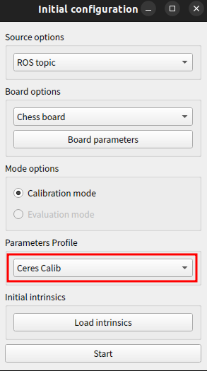
        - Set “Board options” to Chess board
        - Then, press “Start”

    2. On the second dialog:  
        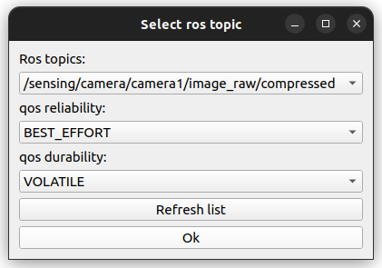
        - Select the target topic to be calibrated as “Ros topics”
        - Set “qos reliability” to BEST_EFFORT
        - Set “qos durability” to VOLATILE
        - Then, press “Ok”

    3. On the main window:  
        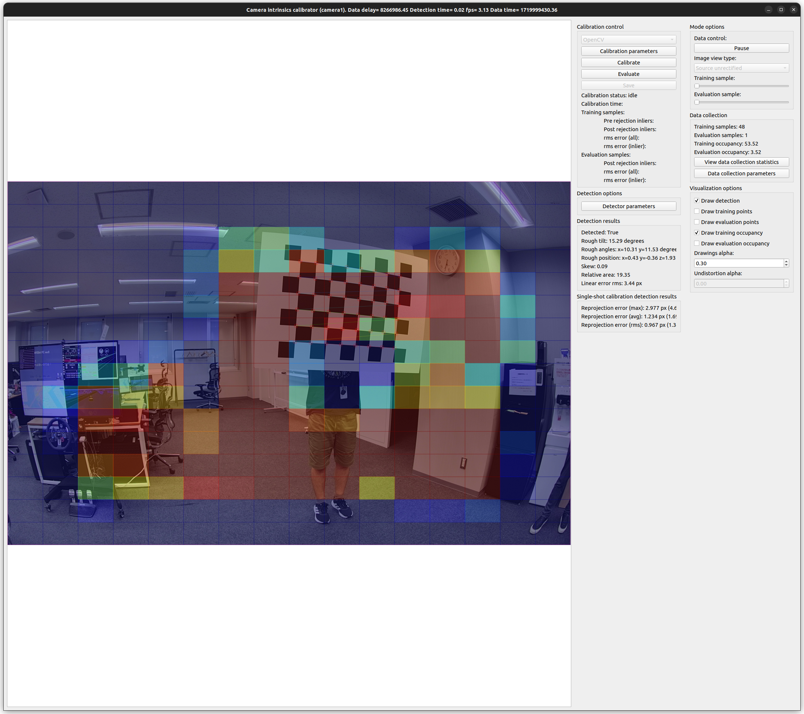
        - In “Visualization options”
            - Check “Draw training occupancy”
            - Set “Drawings alpha” to 0.3
        - [Just confirm] In “Calibration control” > “Calibration parameters”: set the value of “radial_distortion_coefficients” according to the camera lens FoV  
            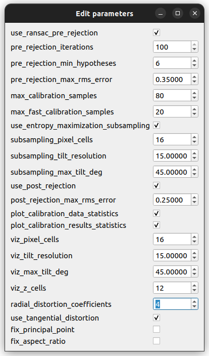
            - 120deg → 4, 30deg → 2
        - “Data collection” > “Data collection parameters”: tune the values of “max_allowed_max_reprojection_error” and “max_allowed_rms_reprojection_error”  
            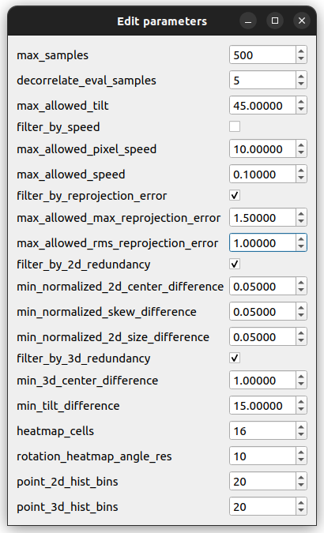
            - In this image, “max_allowed_max_reprojection_error” and “max_allowed_rms_reprojection_error” were set to 1.5 and 1.0, respectively.
            - Tune these values according to the values displayed in “Single-shot calibration detection results”. If the displayed values are frequently higher than the setting values, you have to set larger ones.
                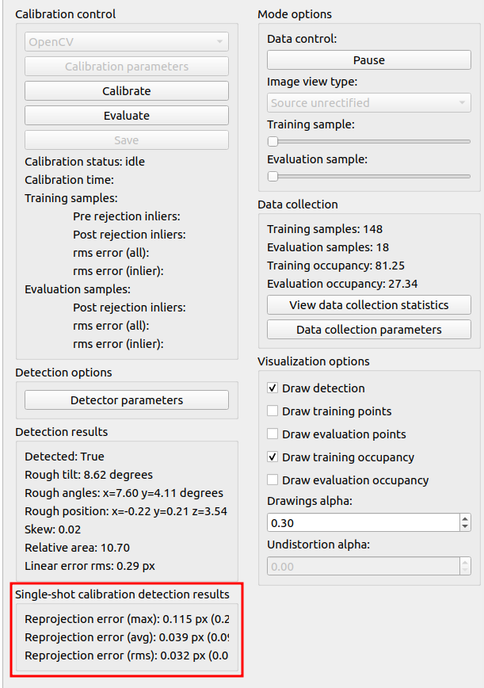
    4. Move the target chessboard slowly until almost all of the cells become red. Including multiple board angles and poses also assists in the generation of accurate intrinsic parameters. Moving the camera instead of the board is also possible.

    5. Once almost all cells turn red, click “Calibration control” > “Calibrate”. When the “calibration status changes from “calibrating” to “idle”, click “Save”.
        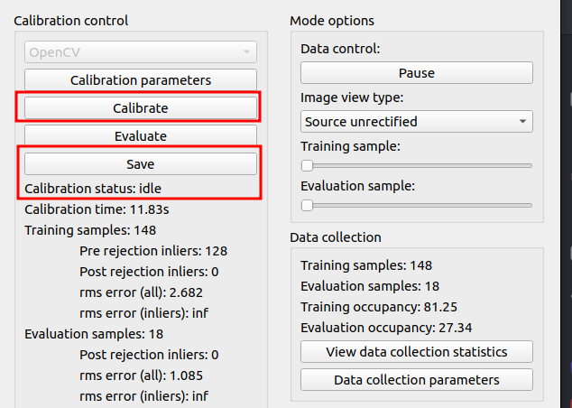
        - If a dialog appears, select a temporary folder (hereafter, `/tmp/camera_x`) to save the results.
        - After you confirm the results are saved, close the main window by pressing the close button on the window title bar. 

## Confirmation and refinement
1. Open the folder named `training_images` that exists under the folder where you saved the results ( `/tmp/camera_x`).

2. Check all of the images saved in the folder. If you find images that have (motion) blur on the target board, remove the images from the folder.

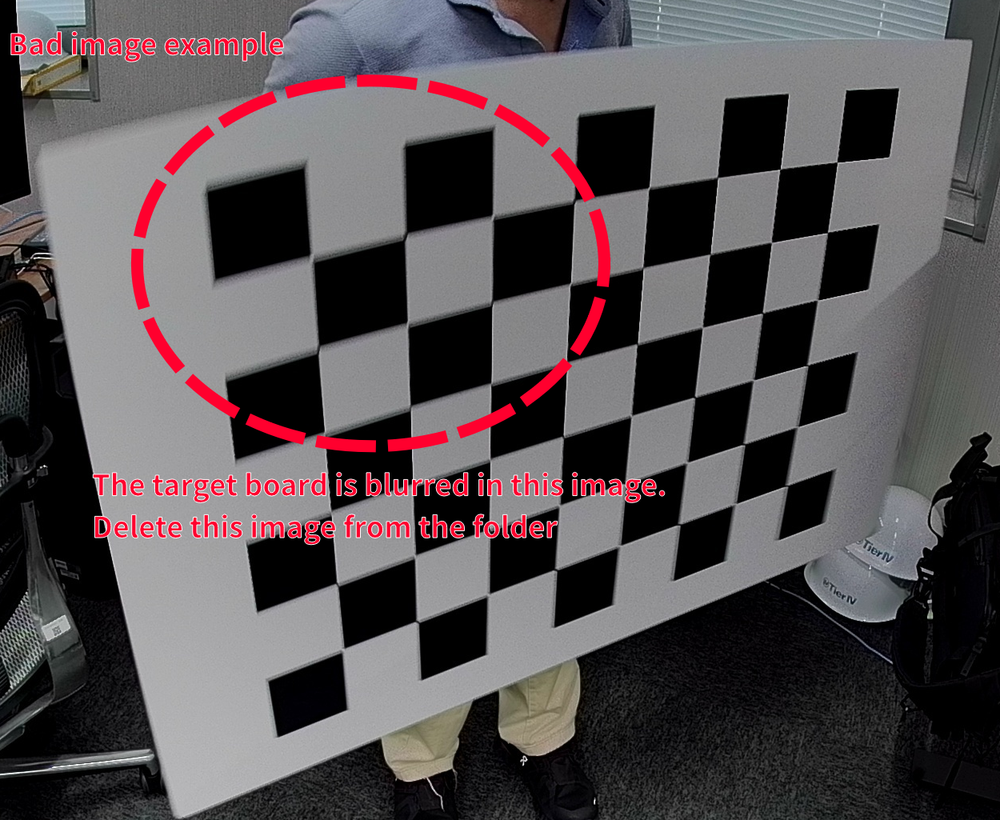

3. Run the tool again 
- For C2-30 (camera0, camera4)
    ```shell
    ros2 run intrinsic_camera_calibrator camera_calibrator \
    --config-file ./install/intrinsic_camera_calibrator/share/intrinsic_camera_calibrator/config/intrinsics_calibrator_c2_30.yaml

    ```
- For C2-120 (camera1, camera2, camera3, camera5, camera6, camera7, camera8)
    ```shell
    ros2 run intrinsic_camera_calibrator camera_calibrator \
    --config-file ./install/intrinsic_camera_calibrator/share/intrinsic_camera_calibrator/config/intrinsics_calibrator_c2_120.yaml
    ```
- On the first dialog:  
    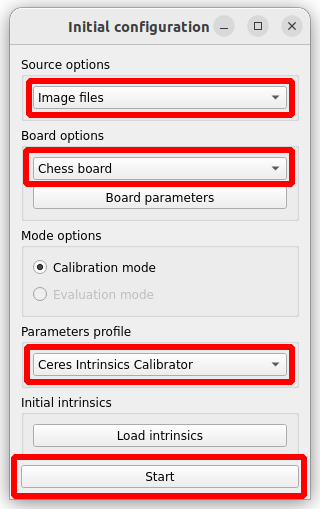
    - Select `Image files` for “Source options”
    - Select `Chess board`  (the same one you selected in the data correction step) for “Board options”
    - Click “Start”

- On the second dialog  
    - Click “Select image files”. Once a dialog to select images opens, select all images under `training_images` in the results saved directory (`/tmp/camera_x`). Then, click “Open”.
    - Click “Ok”

- All selected images will be loaded in the main window automatically. 
- Once the images are loaded, click “Calibration control” > “Calibrate” and “Save”. On the dialog to select a folder to save, select a different folder (e.g. `/tmp/camera_x_refined`) from the previous one (`/tmp/camera_x`).

## Save the result
After pressing the “Save” button on the GUI, you should see `<camera_name>_info.yaml` in the directory you chose. To reflect the calibration result in the system, the following operations are required:
1. Open the yaml file and modify the contents as follows:
    - Fill the `camera_name` field to match the target camera name
        ```patch
        --- ./camera_info.yaml.before
        +++ ./camera_info.yaml.after
        @@ -1,6 +1,6 @@
        image_width: 2880
        image_height: 1860
        -camera_name: ''
        +camera_name: 'camera0' # <- change to match the target camera name
        ```
    - [120deg camera only] Change distortion model parameters
        ```patch
        --- ./camera_info.yaml.before
        +++ ./camera_info.yaml.after
        @@ -5,10 +5,10 @@
        rows: 3
        cols: 3
        data: [5368.25873, 0.0, 1412.70938, 0.0, 5364.46693, 958.59729, 0.0, 0.0, 1.0]
        -distortion_model: plumb_bob
        +distortion_model: rational_polynomial  # <- change to more complex model to handle 120deg
        distortion_coefficients:
        rows: 1
        -  cols: 5
        +  cols: 14  # <- increase the number of coefficients to handle large distortion
        ```
2. Copy the modified file to the corresponding ECU. The ECU camera assignment is as follows:
    - ECU1: camera0, 1, 2, and 3
    - ECU2: camera4, 5, 6, and 7
    - The replacement target looks like: 
        ```
        data_recording_system/src/individual_params/config/default
        ├── aeva_lidar.param.yaml
        ├── camera0
        │   ├── ...
        │   └── camera_info.yaml  # <- for camera0, replace the contents of this file
        ├── camera1
        │   ├── ...
        │   └── camera_info.yaml
        ├── camera2
        │   ├── ...
        │   └── camera_info.yaml
        ├── camera3
        │   ├── ...
        │   └── camera_info.yaml
        ├── camera4
        │   ├── ...
        │   └── camera_info.yaml
        ├── camera5
        │   ├── ...
        │   └── camera_info.yaml
        ├── camera6
        │   ├── ...
        │   └── camera_info.yaml
        ├── camera7
        │   ├── ...
        │   └── camera_info.yaml
        └...
        ```

# Camera-LiDAR extrinsic calibration
Tool reference document: [tag_based_pnp_calibrator.md](https://github.com/tier4/CalibrationTools/blob/feat/drs/docs/tutorials/tag_based_pnp_calibrator.md)

1. Preparation
```shell
cd calibration_tools
source ./install/setup.bash
```

2. Execute the LiDAR packet decoder on the connected PC where the calibration tool will run. This reduces network load and topic delay.
- For the front LiDAR:
    ```
    ros2 launch drs_launch drs_seyond.launch.xml \
    lidar_position:=front lidar_model:=Falcon \
    live_sensor:=false sensor_ip:=192.168.2.201 host_ip:=192.168.2.1
    ```
- For the right LiDAR:
    ```
    ros2 launch drs_launch drs_seyond.launch.xml \
    lidar_position:=right lidar_model:=RobinW \
    live_sensor:=false sensor_ip:=192.168.3.203 host_ip:=192.168.3.1
    ```
- For the rear LiDAR:
    ```
    ros2 launch drs_launch drs_seyond.launch.xml \
    lidar_position:=rear lidar_model:=Falcon \
    live_sensor:=false sensor_ip:=192.168.2.202 host_ip:=192.168.2.2
    ```
- For the left LiDAR:
    ```
    ros2 launch drs_launch drs_seyond.launch.xml \
    lidar_position:=left lidar_model:=RobinW \
    live_sensor:=false sensor_ip:=192.168.3.204 host_ip:=192.168.3.2 
    ```

3. Execute the tool
    ```shell
    ros2 run sensor_calibration_manager sensor_calibration_manager
    ```
4. Perform calibration for each camera-LiDAR pair
    1. On the first dialog:  
        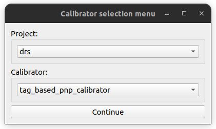
        - Select drs for “Project”
        - Select tag_based_pnp_calibrator for “Calibrator”
        - Then, press “Continue” 

    2. On the second dialog:
        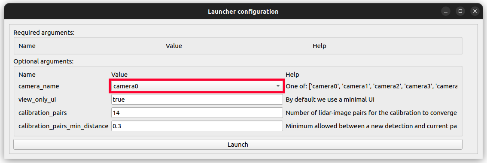
        - Select the target camera name in “camera_name”. The correct corresponding LiDAR will be chosen by the tool.
        - Then, press “Launch”. After pressing the button, 3 popup windows will appear.

    3. UI preparation
        1. In the “Image view” window, select Current /tf for “TF source”
            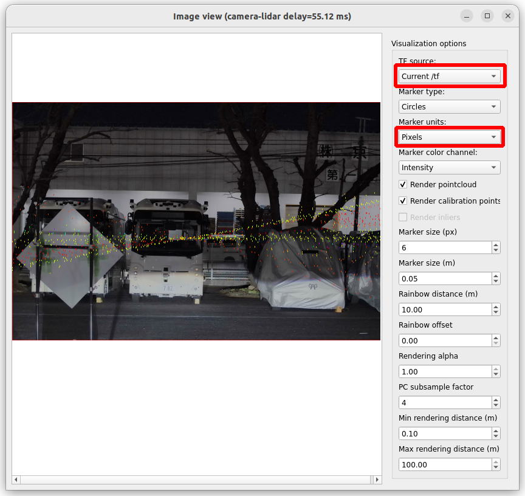
        2. In the Rviz window, insert the appropriate LiDAR frame (e.g. `lidar_front` for the front LiDAR) for “Global Options > Fixed Frame”.  
            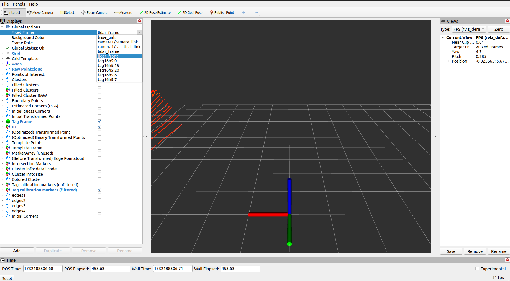
        3. In the “sensor_calibration_manager” window, press the “Calibrate” button. Pressing this button triggers detection of the april tagboard.
            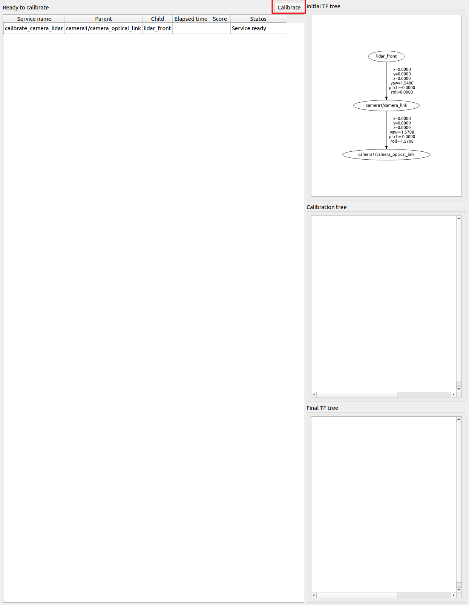
        4. Once the calibration process is triggered, some text will appear in the RViz window. If the april tag is detected in both the LiDAR pointcloud and the camera image, the number of pairs increases.  
            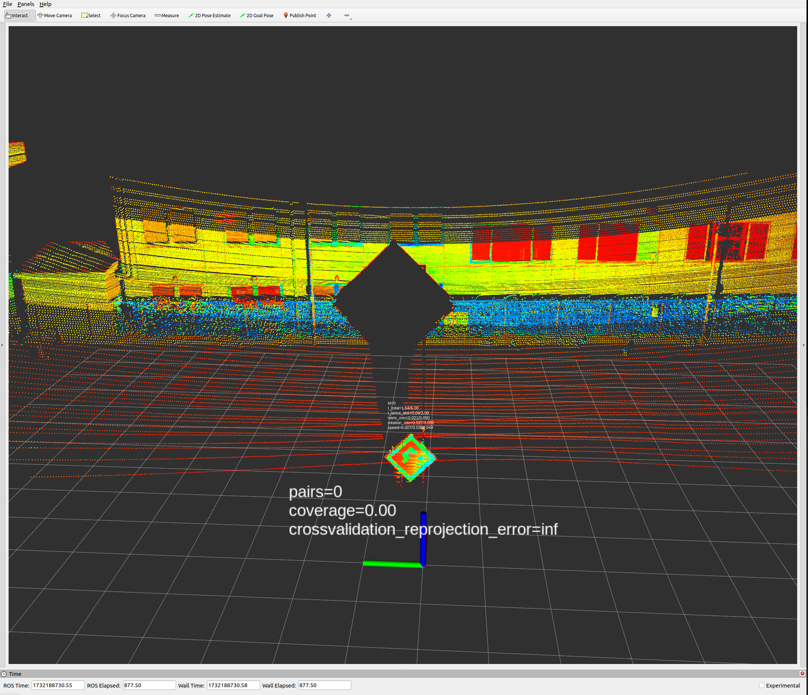
            - As the number of detected pairs increases, proper projection results will be displayed on the “Image view” window.
                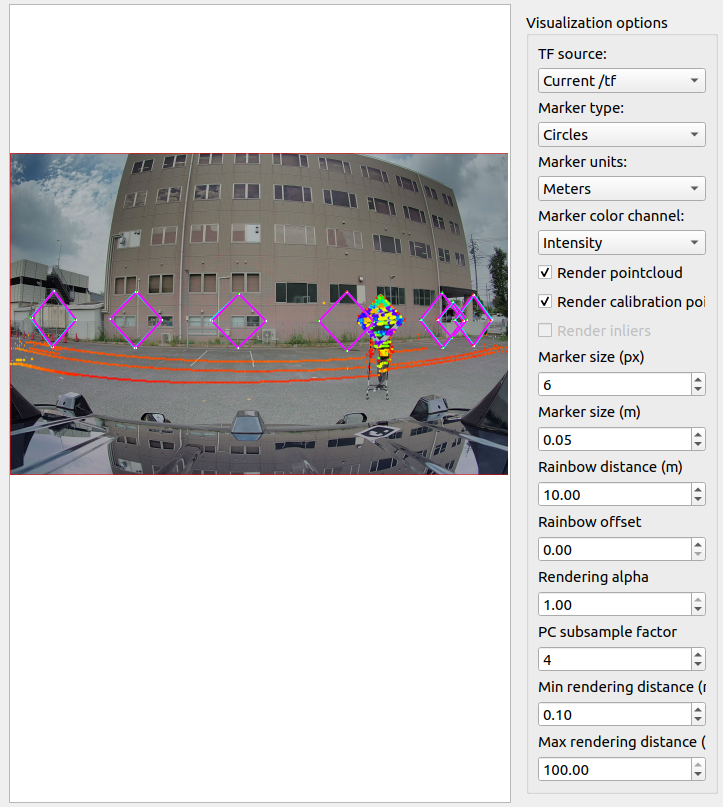
        5. Move the board so that the location of detected pairs covers as wide an area of sensor FoV as possible. During this process, keep an eye on the value of `crossvalidation_reprojection_error`. If this value gets extremely high (like over 10), there may be an issue (e.g., published `camera_info` is not the proper (calibrated) one). 
            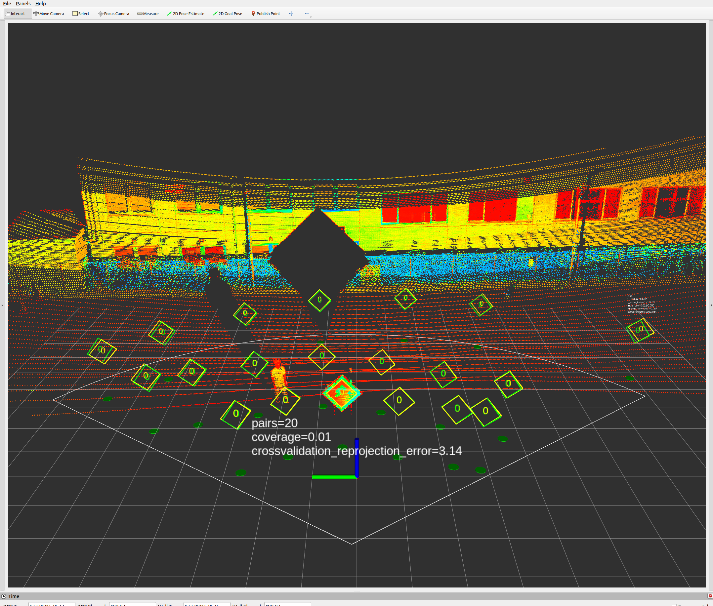
        6. When the number of detected pairs is over the predefined value, the “Save calibration” button will become available. After collecting sufficient data, press the button and save the result into a yaml file. After confirming that the result is correctly saved, close all windows. 
            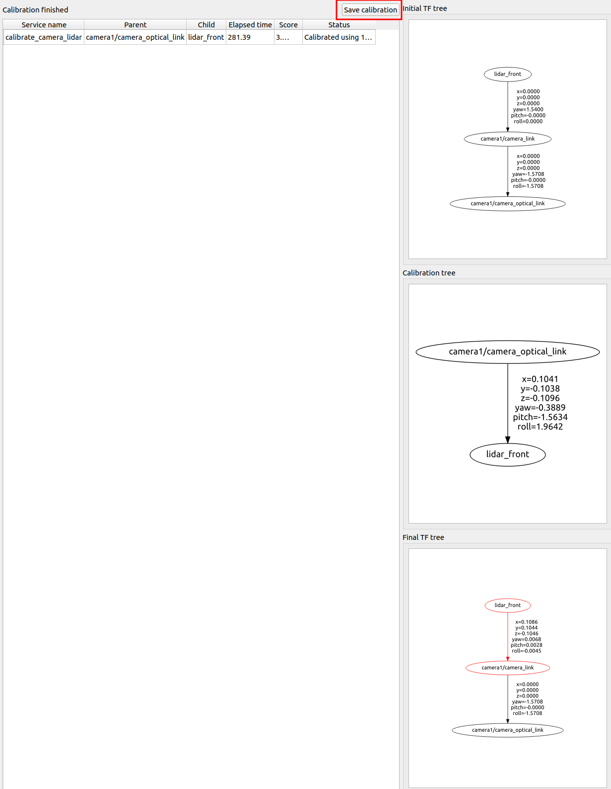

# LiDAR-LiDAR calibration
Tool reference document: [mapping_based_calibrator.md](https://github.com/tier4/CalibrationTools/blob/feat/drs/docs/tutorials/mapping_based_calibrator.md)

> [!NOTE]
> The calibration process itself should be run offline because data from multiple LiDARs are stored in separate rosbags and merging is required.

1. Collect data for calibration. For accurate calibration, a large figure-eight or oval driving trajectory are suitable. Capturing the same static area with all of the LiDARs is key. It is important to use an open area and minimize dynamic objects in the scene.
    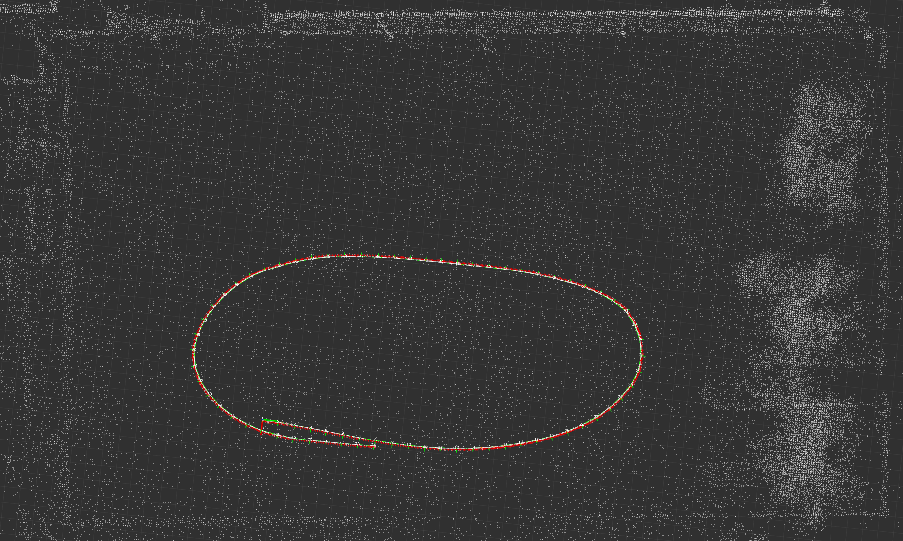
 
2. Merge rosbags for calibration data
> [!NOTE]
> This script needs to be provided by TIER IV.
```shell
pip install mcap
# git clone git@github.com:tier4/CoMLOpsDatasetTools.git
cd CoMLOpsDatasetTools/merge_and_split_rosbag
python3 merge_and_split_rosbag/merge_and_split_rosbag.py INPUT_ROSBAG1_DIR INPUT_ROSBAG2_DIR OUTPUT_DIR
# The above script merge all rosbags from two ECUs and split them into separate directories.
# Move all merged mcap files into one directory
cd OUTPUT_DIR
for i in $(find ./ -name *.mcap); do cp "${i}" "$(basename ${i} | sed 's/_0.mcap/.mcap/g')"; done
# Reindex rosbag for convenience
ros2 bag reindex .
```

3. Execute the tool
```shell
# terminal 1: Run DRS offline launcher for decoding LiDAR packets
ros2 launch drs_launch drs_offline.launch.xml
# terminal 2: Run calibration tool
ros2 run sensor_calibration_manager sensor_calibration_manager
```
4. Configure the tool
    1. On the first dialog:  
        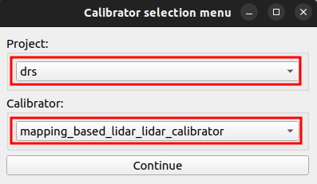
        - Select drs for “Project”
        - Select mapping_based_lidar_lidar_calibrator for “Calibrator”
        - Then, press “Continue”

    2. On the second dialog:
        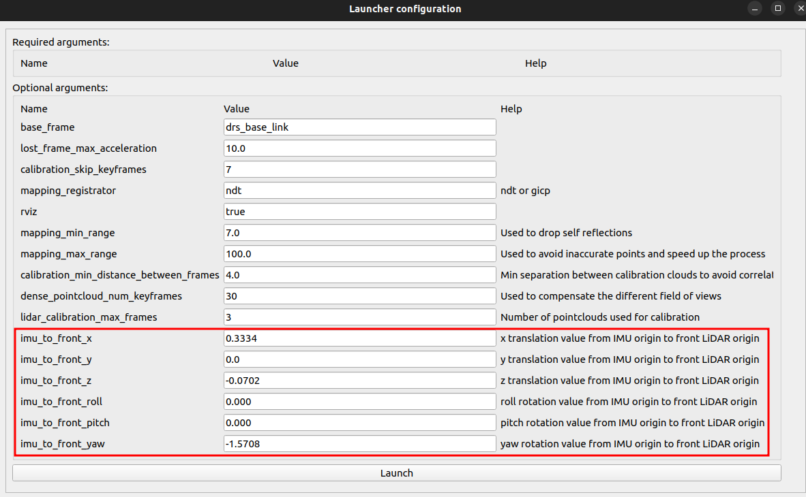
        - Tune the value of “imu_to_front_*” according to the sensors' installation design. The values represent the origin pose of the front LiDAR in terms of INS origin.
        - After tuning, press “Launch”

    3. On the third dialog:
        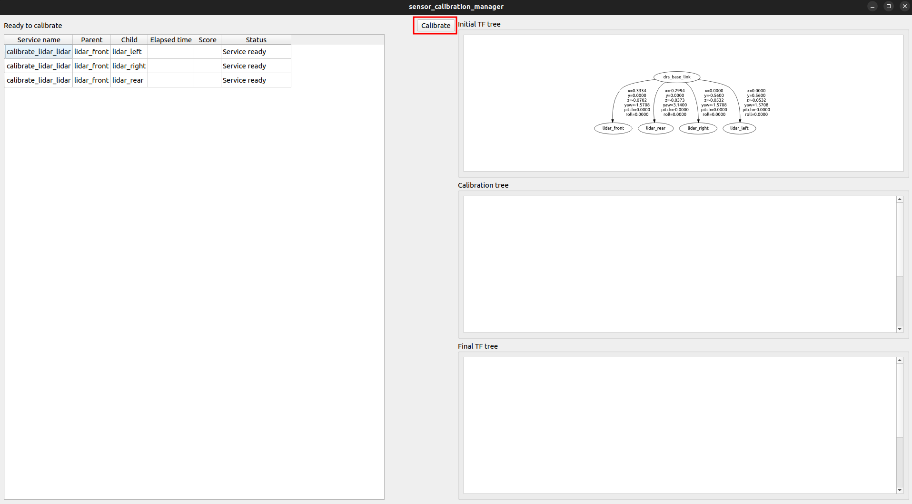
        - Press “Calibrate” to start the calibration process.

5. Play the rosbag
    ```
    cd OUTPUT_DIR
    ros2 bag play -r 0.1 .
    ```
    - Make sure to play rosbag at a delayed rate. Playing too fast will cause a calibration failure. 
    - Keyframe positions should be seen/added on the RViz
        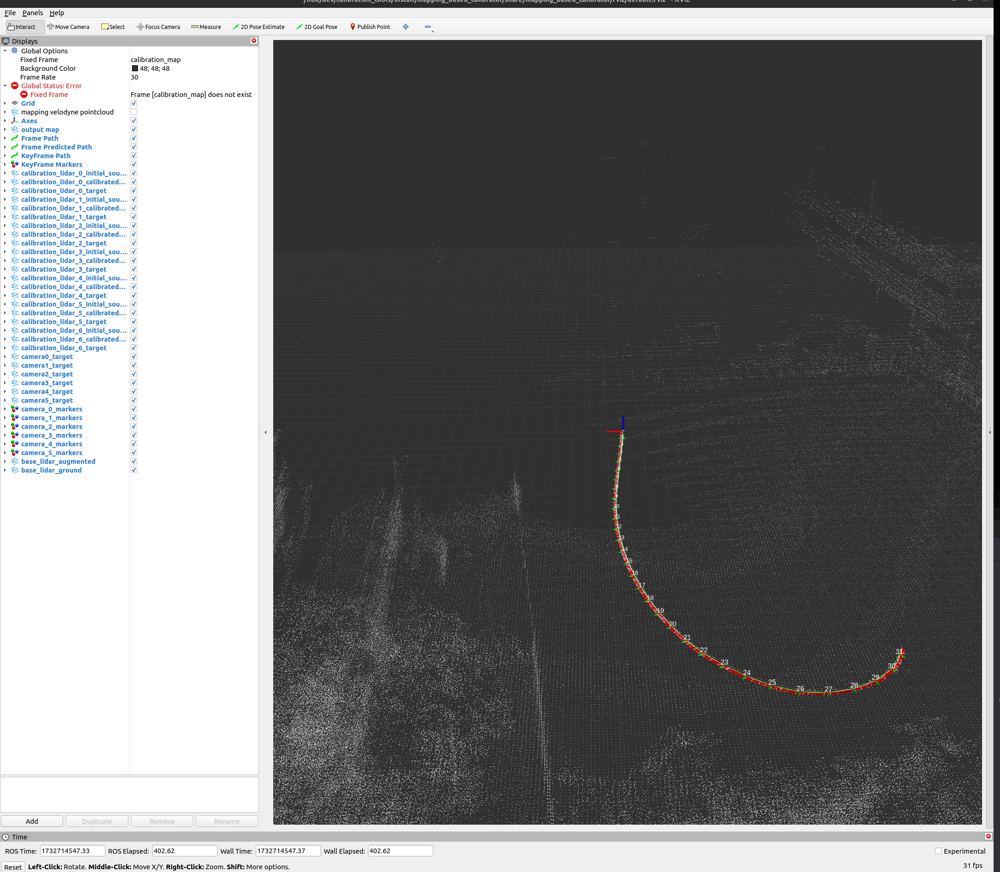
    - Wait until playing finishes

6. Once the rosbag has finished playing, execute the following to notify the tools that the end of the data has been reached:
    ```
    ros2 service call /stop_mapping std_srvs/srv/Empty  
    ```
7. After calling the above service, the tool starts alignment (this may take a while). Once the alignment finishes, the “Save calibration” button on the third dialog will become available. If the button is enabled, press it and save the result.
    
 

# Related articles
- [https://tier4.atlassian.net/wiki/spaces/~621c20116a4c4c0070ac66d7/pages/3354591916/DRS+calibration]()
- [https://tier4.atlassian.net/wiki/spaces/~621c20116a4c4c0070ac66d7/pages/3176432083/DRS+setup+on+Anvil]()
- [https://tier4.atlassian.net/wiki/spaces/~621c20116a4c4c0070ac66d7/pages/3361604453/DRS+sensor]()
