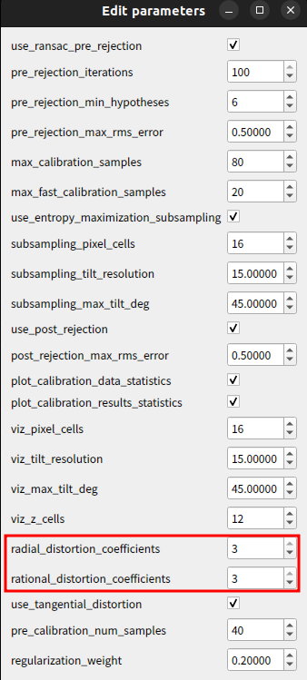
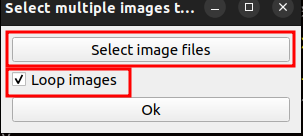
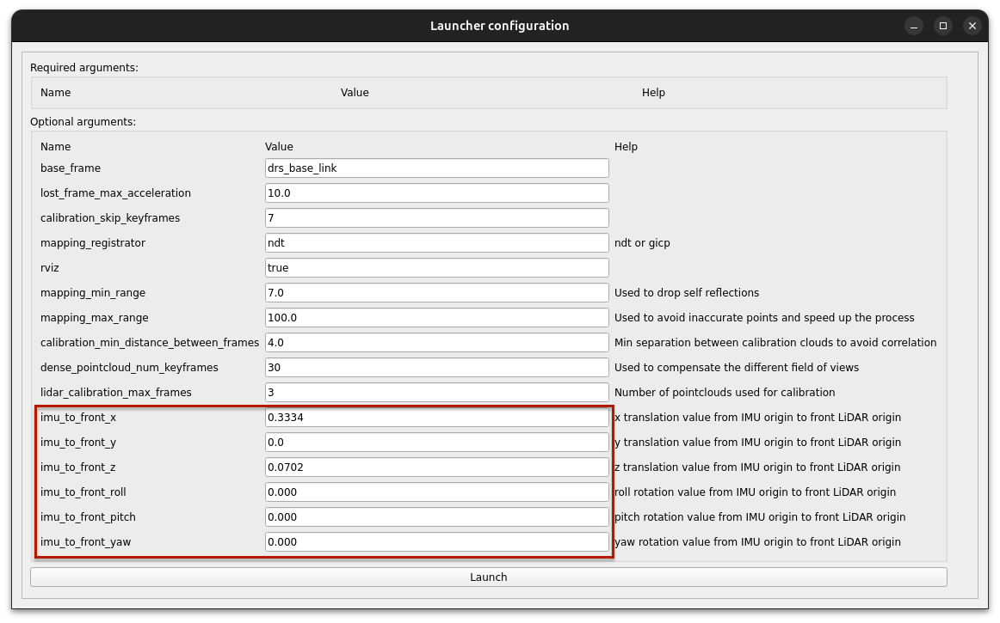
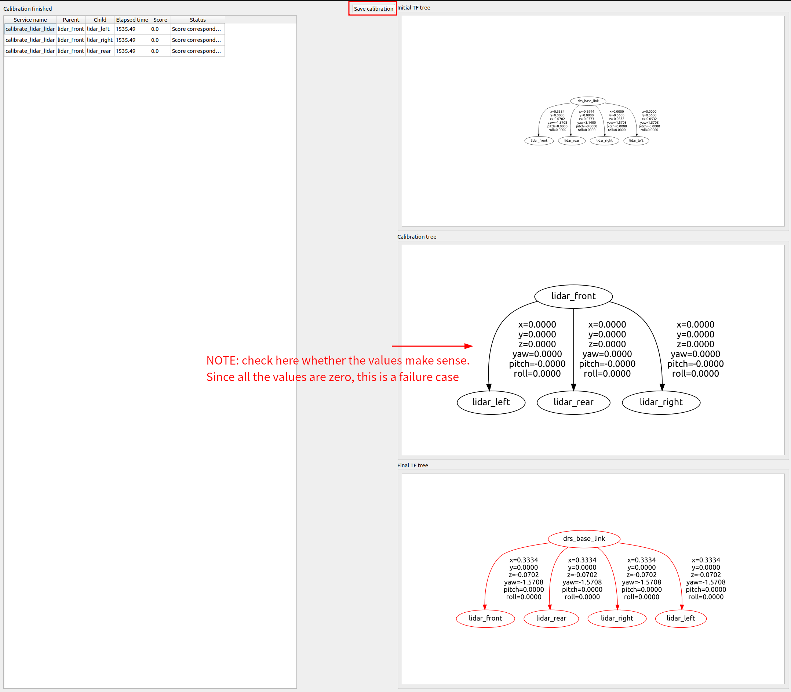

DRS calibration
---
- [Setup](#setup)
  - [Using Docker (Recommended)](#using-docker-recommended)
    - [Prerequisites for using docker](#prerequisites-for-using-docker)
    - [For DRS components](#for-drs-components)
    - [For Calibration tool](#for-calibration-tool)
  - [Building from source](#building-from-source)
    - [Prerequisites for building from source](#prerequisites-for-building-from-source)
    - [Install required DRS components (on the setup PC)](#install-required-drs-components-on-the-setup-pc)
    - [Install calibration tool](#install-calibration-tool)
- [Sensor operation check](#sensor-operation-check)
  - [Camera](#camera)
  - [LiDAR](#lidar)
- [Camera intrinsic calibration](#camera-intrinsic-calibration)
  - [Confirmation and refinement](#confirmation-and-refinement)
    - [Confirm the result](#confirm-the-result)
    - [Refinement](#refinement)
  - [Save the result](#save-the-result)
- [Camera-LiDAR extrinsic calibration](#camera-lidar-extrinsic-calibration)
- [LiDAR-LiDAR calibration](#lidar-lidar-calibration)
  - [Result confirmation](#result-confirmation)
  - [Put the result to the right place](#put-the-result-to-the-right-place)
- [Design values between `base_link` and `drs_base_link`](#design-values-between-base_link-and-drs_base_link)
- [Related articles](#related-articles)

# Setup


In this manual, it is assumed that the camera and LiDAR data are delivered over ROS topics to a separate PC where the calibration tools are run. The right-most port of both Anvil ECUs is reserved for ROS communication with the PC, which should be configured to have a static IP address of `192.168.20.*/24` on the port connected to the Anvil ECU (`*` can be replaced with any number between 3 and 255).

The correction configuration to calibrate the sensors connected to DRS ECU0 is illustrated in the following diagram:


There are two ways to set up the required environment: using Docker (recommended) or building from source locall

## Using Docker (Recommended)

### Prerequisites for using docker

* **OS**: Ubuntu 22.04

* **Docker**: Follow the installation guide for Ubuntu [here](https://docs.docker.com/engine/install/ubuntu/).

* **NVIDIA Container Toolkit**: Follow the installation guide [here](https://docs.nvidia.com/datacenter/cloud-native/container-toolkit/latest/install-guide.html).

* **Data Recording System**: Clone the git repository: `git clone https://github.com/tier4/data_recording_system.git -b develop/r36.4.0`  
  > [!NOTE] Development branch: develop/r36.4.0

* Operation confirmed on a laptop with: CPU: Core i7-11800H, RAM: 32GB, GPU: RTX 3060 Mobile.

### For DRS components (runtime docker container)

The calibration process requires some components of the DRS package. Those components are available in the runtime docker container launched by the below command.

```shell
./data_recording_system/docker/runtime/run.sh bash
```


### For calibration tool (calibration docker container)

The calibration tool is available in the calibration docker container launched by the below command.
The command line option is to mount the host directory to /tmp/calib to save the calibration results outside the docker container.
Please modify the directory according to your usage environment.

```shell
# This command runs the calibration tool. The calibration result shall be saved to the specified directory on your computer.
./data_recording_system/docker/calibration/run.sh --option -v [result_saving_directory]:/tmp/calib -- bash
```

## Building from source

### Prerequisites for building from source

* **OS**: Ubuntu 22.04

* **ROS**: ROS 2 Humble

* **DDS**: cyclonedds
  * DRS uses [CycloneDDS](https://github.com/eclipse-cyclonedds/cyclonedds) as DDS middleware. Particular configurations for the DDS are required on the PC on which the calibration tools run so that the pc and DRS ECUs communicate smoothly.

  * Install with: `sudo apt install ros-humble-rmw-cyclonedds-cpp`

  * For configuration details, see: [DDS settings](https://autowarefoundation.github.io/autoware-documentation/main/installation/additional-settings-for-developers/network-configuration/dds-settings/)

* **CUDA**: CUDA Toolkit 12.6

* Operation confirmed on a laptop with: CPU: Core i7-11800H, RAM: 32GB, GPU: RTX 3060 Mobile.

### Install required DRS components

The calibration process requires some components of the DRS package to be built locally. As we will run the calibration tools on a separate connected PC, the following DRS components must be installed manually.

> [!NOTE]
> The source code will be provided by TIER IV as it is currently hosted in a private repository.


```shell
git clone https://github.com/tier4/data_recording_system.git -b develop/r36.4.0
cd data_recording_system
mkdir src
vcs import src < drs.repos
rosdep install -y -r --from-paths `colcon list --packages-up-to drs_launch -p` --ignore-src
# build required packages
colcon build \
    --symlink-install --continue-on-error --cmake-args -DCMAKE_BUILD_TYPE=RelWithDebInfo \
    --packages-up-to drs_launch 

# Add the environment setup to .bashrc.
# Replace [your_directory] with the actual path to your clone directory.
echo '
if [ -f [your_clone_directory]/data_recording_system/install/setup.bash ]; then
    source [your_clone_directory]/data_recording_system/install/setup.bash
fi' >> ~/.bashrc
```

### Install calibration tool

```shell
git clone https://github.com/tier4/CalibrationTools.git -b feat/drs_202505 /opt/drs/src/calibration_tools
cd calibration_tools
mkdir src
vcs import src < calibration_tools_standalone.repos
rosdep install -y -r --from-paths \
  `colcon list --packages-up-to sensor_calibration_tools -p` \
   --ignore-src
# build the tools
colcon build --symlink-install --cmake-args -DCMAKE_BUILD_TYPE=RelWithDebInfo \
  --packages-up-to sensor_calibration_tools
```

# Sensor operation check

Before starting the calibration, it is recommended to check if all sensors are working correctly.

## Camera

Check each camera from `camera0` to `camera7` sequentially to ensure they are streaming images correctly and that the camera ID matches its physical mounting position.

1. Launch the sensor drivers on the ECUs if they are not already running.
    ```shell
    # SSH into the ECU0 and ECU1 that target sensors are connected
    # example ECU0: ssh nvidia@192.168.20.1 
    sudo systemctl start drs-sensor.service
    ```

2. On the calibration PC, open a new terminal and use `rqt_image_view` to visualize the image topic for each camera.  
  If you use docker, please execute it on the runtime docker container.
    ```shell
    ros2 run rqt_image_view rqt_image_view
    ```

3. For each camera, verify that:

    * An image is displayed correctly.

    * The camera number in the topic name corresponds to the physical mounting position on the vehicle.
    

## LiDAR

Check each LiDAR to ensure that it is publishing point cloud data and that its TF is correctly positioned.

1. On the calibration PC, launch the point cloud decoder with TF publishing enabled.  
  If you use docker, please execute it on the runtime docker container.
    ```shell
    # Assumes you are in the appropriate docker container or have sourced the workspace
    ros2 launch drs_launch drs_offline.launch.xml publish_tf:=true
    ```

2. Open RViz2.
    ```shell
    rviz2
    ```

3. In RViz2:

    * Set the `Fixed Frame` in `Global Options` to `base_link`.

    * Add a `PointCloud2` display for each LiDAR topic (e.g., `/sensing/lidar/front/nebula_points`).

    * Set all the `Reliability Policy` in `PointCloud2/Topic` to `Best Effort`.

    * Set all the `Color Transformer` in  `PointCloud2` to `FlatColor` and specify different colors for each LiDAR.

    * Add a `TF` display to visualize the frames.

4. Verify that:

    * The point cloud is displayed for each LiDAR.

    * The position of each LiDAR's point cloud in the 3D space matches its physical mounting position on the vehicle.
    


# Camera intrinsic calibration
Tool reference document: [intrinsic_camera_calibrator.md](https://github.com/tier4/CalibrationTools/blob/feat/drs/docs/tutorials/intrinsic_camera_calibrator.md) 

1. Preparation
    ```shell
    # If you choose “Using Docker”
    cd /opt/drs

    # If you choose “Building from source”
    cd calibration_tools
    source ./install/setup.bash
    ```
2. Execute the tool
<a name="execute_intrinsic_tool"></a>
- For C2-30 (camera0, camera4)
    ```shell
    ros2 run intrinsic_camera_calibrator camera_calibrator \
    --config-file ./install/intrinsic_camera_calibrator/share/intrinsic_camera_calibrator/config/intrinsics_calibrator_c2_30.yaml
    ```
- For C2-120 (camera1, camera2, camera3, camera5, camera6, camera7, camera8)
    ```shell
    ros2 run intrinsic_camera_calibrator camera_calibrator \
        --config-file ./install/intrinsic_camera_calibrator/share/intrinsic_camera_calibrator/config/intrinsics_calibrator_c2_120.yaml
    ```
3. Perform calibration for each camera
    1. On the first dialog:  
        
        - Set “Board options” to Chess board
        - Set "Parameters Profile" to Ceres Intrinsics Calibrator
        - Then, press “Start”

    2. On the second dialog:  
        
        - Select the target topic to be calibrated as “Ros topics”
        - Set “qos reliability” to BEST_EFFORT
        - Set “qos durability” to VOLATILE
        - Then, press “Ok”

    3. On the main window:  
        
        - In “Visualization options”
            - Check “Draw training occupancy”
            - Set “Drawings alpha” to 0.3
        - In "Calibration control" > "Calibration parameters": set the value of "radial_distortion_coefficients" and "rational_distortion_coefficients" according to the camera lens FoV
            
            - 030deg → radial: 2, rational: 0
            - 120deg → radial: 3, rational: 3
        <!-- - “Data collection” > “Data collection parameters”: tune the values of “max_allowed_max_reprojection_error” and “max_allowed_rms_reprojection_error”   -->
        <!--      -->
        <!--     - In this image, “max_allowed_max_reprojection_error” and “max_allowed_rms_reprojection_error” were set to 1.5 and 1.0, respectively. -->
        <!--     - Tune these values according to the values displayed in “Single-shot calibration detection results”. If the displayed values are frequently higher than the setting values, you have to set larger ones. -->
        <!--          -->
    4. Move the target chessboard slowly until almost all of the cells become red. Including multiple board angles and poses also assists in the generation of accurate intrinsic parameters. Moving the camera instead of the board is also possible.

    5. Once almost all cells turn red, click “Calibration control” > “Calibrate”. When the “calibration status changes from “calibrating” to “idle”, click “Save”.
        
        - If a dialog appears, select a temporary folder (hereafter, `/tmp/calib/cameraX`) to save the results.
        - After you confirm the results are saved, close the main window by pressing the close button on the window title bar. 

## Confirmation and refinement
### Confirm the result
reference: https://github.com/tier4/CalibrationTools/blob/feat/drs/docs/tutorials/intrinsic_camera_calibrator.md#12-evaluation

1. Execute the tool same as [here](#execute_intrinsic_tool).

2. Switch the tool to the evaluation mode
   1. On the first dialog:  
      
      - Set "Source options" to Image files
      - Set "Parameters Profile" to Ceres Calib
      - Click "Load Intrinsics" and select saved result yaml file. Once the result yaml file (*_info.yaml) is loaded, Evaluation mode in the "Mode options" becomes enabled.
      - Then, press "Start"

   2. On the second dialog:  
      
      - Press "Select images files". In file selection dialog, select image files that were taken by the camera to be evaluated. As an example for the selection, the folder that you selected to save the intrinsic calibration results also contains a sub folder named `evaluation_images/`, and that sub folder contains sampled images from the camera.
      - Check "Loop images" option
      - Then, press "Ok"

   3. On the main window:  
      
      - Set "Mode options" > "Image view type" to `Source rectified`
      - Set "Visualization options" > "Undistortion alpha" to `1.00`
      - Once the undistortion alpha is set, a rectified image with blank area will be shown. You can briefly check the intrinsic result quality by checking the shape of this blank area. If the shape looks roughly symmetric and the image stretches toward corners (i.e., the result image stretches like an X shape), intrinsic calibration was possibly succeeded (we can say "not bad" at least). 
      - If a completely asymmetric result like the following is shown, there is a high possibility that intrinsic calibration went wrong. In that case, consider redoing the calibration process or refining data introduced in the next section. 

### Refinement
1. Open the folder named `training_images` that exists under the folder where you saved the results ( `/tmp/calib/cameraX`).

2. Check all of the images saved in the folder. If you find images that have (motion) blur on the target board, remove the images from the folder.


3. Run the tool again 
- For C2-30 (camera0, camera4)
    ```shell
    ros2 run intrinsic_camera_calibrator camera_calibrator \
    --config-file ./install/intrinsic_camera_calibrator/share/intrinsic_camera_calibrator/config/intrinsics_calibrator_c2_30.yaml

    ```
- For C2-120 (camera1, camera2, camera3, camera5, camera6, camera7, camera8)
    ```shell
    ros2 run intrinsic_camera_calibrator camera_calibrator \
    --config-file ./install/intrinsic_camera_calibrator/share/intrinsic_camera_calibrator/config/intrinsics_calibrator_c2_120.yaml
    ```
- On the first dialog:  
    
    - Select `Image files` for “Source options”
    - Select `Chess board`  (the same one you selected in the data correction step) for “Board options”
    - Select `Ceres Intrinsics Calibrator` for "Parameters Profile"
    - Click “Start”

- On the second dialog  
    - Click “Select image files”. Once a dialog to select images opens, select all images under `training_images` in the results saved directory (`/tmp/calib/cameraX`). Then, click “Open”.
    - Click “Ok”

- All selected images will be loaded in the main window automatically. 
- Once the images are loaded, click “Calibration control” > “Calibrate” and “Save”. On the dialog to select a folder to save, select a different folder (e.g. `/tmp/calib/cameraX_refined`) from the previous one (`/tmp/calib/cameraX`).

## Save the result
After pressing the “Save” button on the GUI, you should see `<camera_name>_info.yaml` in the directory you chose. To reflect the calibration result in the system, the following operations are required:
1. Open the yaml file and modify the contents as follows:
    - Fill the `camera_name` field to match the target camera name
        ```patch
        --- ./camera_info.yaml.before
        +++ ./camera_info.yaml.after
        @@ -1,6 +1,6 @@
        image_width: 2880
        image_height: 1860
        -camera_name: ''
        +camera_name: 'camera0' # <- change to match the target camera name
        ```
    - [120deg camera only] Change distortion model parameters
        ```patch
        --- ./camera_info.yaml.before
        +++ ./camera_info.yaml.after
        @@ -5,10 +5,10 @@
        rows: 3
        cols: 3
        data: [5368.25873, 0.0, 1412.70938, 0.0, 5364.46693, 958.59729, 0.0, 0.0, 1.0]
        -distortion_model: plumb_bob
        +distortion_model: rational_polynomial  # <- change to more complex model to handle 120deg
        distortion_coefficients:
        rows: 1
        -  cols: 5
        +  cols: 8  # <- increase the number of coefficients to handle large distortion
        ```
2. Copy the modified file to the corresponding ECU. The ECU camera assignment is as follows:
    - ECU0: camera0, 1, 2, and 3
    - ECU1: camera4, 5, 6, and 7
    - The replacement target looks like: 
        ```
        data_recording_system/src/individual_params/config/default
        ├── aeva_lidar.param.yaml
        ├── camera0
        │   ├── ...
        │   └── camera_info.yaml  # <- for camera0, replace the contents of this file
        ├── camera1
        │   ├── ...
        │   └── camera_info.yaml
        ├── camera2
        │   ├── ...
        │   └── camera_info.yaml
        ├── camera3
        │   ├── ...
        │   └── camera_info.yaml
        ├── camera4
        │   ├── ...
        │   └── camera_info.yaml
        ├── camera5
        │   ├── ...
        │   └── camera_info.yaml
        ├── camera6
        │   ├── ...
        │   └── camera_info.yaml
        ├── camera7
        │   ├── ...
        │   └── camera_info.yaml
        └...
        ```

# Camera-LiDAR extrinsic calibration
Tool reference document: [tag_based_pnp_calibrator.md](https://github.com/tier4/CalibrationTools/blob/feat/drs/docs/tutorials/tag_based_pnp_calibrator.md)

> [!NOTE]
> The following calibration procedure assumes specific ID and orientation for the target April tag.
> This exact tag needs to be mounted to the frame in the illustrated orientation:  
> 

1. Stop the senosrs  
    a. from dashboard  

        1. Access to WiFi access points in the vehicle  
           access point name: drs-[vehicle name]-ap  
           Passwords will be notified separately using a secure method.
        
        2. Open http://drs-dashboard:3000

        3. Stop sensor service for ECU0 and ECU1  
    
    
    b. from ECU  

    ```shell
    # SSH into the ECU0 and ECU1 that target sensors are connected
    # example ECU0: ssh nvidia@192.168.20.1 
    sudo systemctl stop drs-sensor.service
    ```

2. Launch ros-related function without TF broadcasting on ECU
    ```shell
    # SSH into the ECU that target sensors are connected
    # example ECU0: ssh nvidia@192.168.20.1 
    #
    # manually execute ros-related function without TF broadcasting
    source /opt/drs/install/setup.bash
    ros2 launch drs_launch drs.launch.xml publish_tf:=false param_root_dir:=/opt/drs/config/params
    ```

3. Execute the LiDAR packet decoder on the connected PC where the calibration tool will run. This reduces network load and topic delay.  
  If you use docker, please execute it on the runtime docker container.
    ```shell
    # launch the LiDAR packet decoder 
    ros2 launch drs_launch drs_offline.launch.xml publish_tf:=false
    ```

4. Execute the tool on the connected PC.  
  If you use docker, please execute it on the calibration docker container.
    ```shell
    # only if you choose “Building from source”
    source calibration_tools/install/setup.bash

    # execute the calibration tool
    ros2 run sensor_calibration_manager sensor_calibration_manager
    ```
5. Perform calibration for each camera-LiDAR pair
    1. On the first dialog:  
        
        - Select drs for “Project”
        - Select tag_based_pnp_calibrator for “Calibrator”
        - Then, press “Continue” 

    2. On the second dialog:
        
        - Select the target camera name in “camera_name”. The correct corresponding LiDAR will be chosen by the tool.
        - Then, press “Launch”. After pressing the button, 3 popup windows will appear.

    3. UI preparation  
        1. In the “Image view” window, select Current /tf for “TF source” and Pixels for "Marker units"  
            
        2. In the Rviz window, insert the appropriate LiDAR frame (e.g. `lidar_front` for the front LiDAR) for “Global Options > Fixed Frame”.  
            
        3. In the “sensor_calibration_manager” window, press the “Calibrate” button. Pressing this button triggers detection of the april tagboard.
            
        4. Once the calibration process is triggered, some text will appear in the RViz window. If the april tag is detected in both the LiDAR pointcloud and the camera image, the number of pairs increases.  
            
            - As the number of detected pairs increases, proper projection results will be displayed on the “Image view” window.
                
        5. Move the board so that the location of detected pairs covers as wide an area of sensor FoV as possible. During this process, keep an eye on the value of `crossvalidation_reprojection_error`. If this value gets extremely high (like over 10), there may be an issue (e.g., published `camera_info` is not the proper (calibrated) one). 
            
        6. When the number of detected pairs is over the predefined value(14), the “Save calibration” button will become available. After collecting sufficient data, press the button and save the result into a yaml file. After confirming that the result is correctly saved, close all windows. 
            - Rename the file to `camera<CAMERA_ID>_calibration_results.yaml`
            - In a later step, these results will be used to make `multi_tf_static.yaml`.
            - The replacement target looks like:
            ```bash
            [temporary_diretory]
            ├── camera0_calibration_results.yaml
            ├── camera1_calibration_results.yaml
            ├── camera2_calibration_results.yaml
            ├── camera3_calibration_results.yaml
            ├── camera4_calibration_results.yaml
            ├── camera5_calibration_results.yaml
            ├── camera6_calibration_results.yaml
            └── camera7_calibration_results.yaml
            ```
            

    <details>
    <summary>If no images are shown in the `image_view` window</summary>

    A possible cause of this issue is poor time synchronization.
    Check the window title of `image_view` window. If the displayed "delay" value is too large, as in the following picture, the tolerance value can be relaxed by modifying `common/tier4_calibration_views/tier4_calibration_views/image_view_ros_interface.py`.

    

    ```patch
    diff --git a/common/tier4_calibration_views/tier4_calibration_views/image_view_ros_interface.py b/common/tier4_calibration_views/tier4_calibration_views/image_view_ros_interface.py
    index c32bf28..61b82bc 100644
    --- a/common/tier4_calibration_views/tier4_calibration_views/image_view_ros_interface.py
    +++ b/common/tier4_calibration_views/tier4_calibration_views/image_view_ros_interface.py
    @@ -55,7 +55,7 @@ class ImageViewRosInterface(Node):
             self.declare_parameter("use_rectified", False)
             self.declare_parameter("use_compressed", True)
             self.declare_parameter("timer_period", 1.0)
    -        self.declare_parameter("delay_tolerance", 0.06)
    +        self.declare_parameter("delay_tolerance", 1.06)
             self.use_rectified = self.get_parameter("use_rectified").get_parameter_value().bool_value
             self.use_compressed = self.get_parameter("use_compressed").get_parameter_value().bool_value
    ```
    </details>

# LiDAR-LiDAR calibration
Tool reference document: [mapping_based_calibrator.md](https://github.com/tier4/CalibrationTools/blob/feat/drs/docs/tutorials/mapping_based_calibrator.md)

> [!NOTE]
> The calibration process itself should be run offline because the calculation after recording will take much time (30mins over).

1. Collect data for calibration by the below command **on ECU**. For accurate calibration, a large figure-eight or oval driving trajectory are suitable. Capturing the same static area with all of the LiDARs is key. It is important to use an open area and minimize dynamic objects in the scene.
    ```shell
    # This command records all LiDAR topics to a bag file and should be executed on ECU.
    # Replace [save_directory] with the path where you want to save the bag file.

    # SSH into the ECU that target sensors are connected
    # example ECU0: ssh nvidia@192.168.20.1 
    ros2 bag record -s mcap /sensing/lidar/front/nebula_packets /sensing/lidar/right/nebula_packets /sensing/lidar/rear/nebula_packets /sensing/lidar/left/nebula_packets -o [save_directory]
    ```

    

2. Execute the tool
    1. Execute the LiDAR packet decoder on the connected PC where the calibration tool will run. This reduces network load and topic delay.  
    If you use docker, please execute it on the runtime docker container.
        ```shell
        # launch the LiDAR packet decoder 
        ros2 launch drs_launch drs_offline.launch.xml publish_tf:=false
        ```

    2. Execute the tool on the connected PC.  
    If you use docker, please execute it on the calibration docker container.
        ```shell
        # only if you choose “Building from source”
        source calibration_tools/install/setup.bash

        # execute the calibration tool
        ros2 run sensor_calibration_manager sensor_calibration_manager
        ```
        
3. Configure the tool
    1. On the first dialog:  
        
        - Select drs for “Project”
        - Select mapping_based_lidar_lidar_calibrator for “Calibrator”
        - Then, press “Continue”

    2. On the second dialog:
        
        - Tune the value of “imu_to_front_*” according to the sensors' installation design. The values represent the origin pose of the front LiDAR in terms of INS origin.
        - After tuning, press “Launch”

    3. On the third dialog:
        
        - Press “Calibrate” to start the calibration process.

4. Play the rosbag
    ```shell
    # Specify the path to the recording data where you saved in the previous step for [recording_data].
    ros2 bag play [recording_data] --clock 100 -r 0.1
    ```
    - Make sure to play rosbag at a delayed rate. Playing too fast will cause a calibration failure. 
    - Keyframe positions should be seen/added on the RViz
        
    - Wait until playing finishes

    > [!NOTE]
    > Because the calibration tool automatically controls pausing/resuming play according to the processing status,
    > you must not control pausing/resuming rosbag play manually.

5. Once the rosbag has finished playing, execute the following to notify the tools that the end of the data has been reached:
    ```
    ros2 service call /stop_mapping std_srvs/srv/Empty  
    ```
6. After calling the above service, the tool starts alignment (**this may take a while**). Once the alignment finishes, the “Save calibration” button on the third dialog will become available. If the button is enabled, press it and save the result.
    - Rename the file to `lidar_calibration_results.yaml`
    - In the next step, this result is used to make `multi_tf_static.yaml`.
    - The replacement target looks like:
    ```bash
    [temporary_diretory]
    ├── lidar_calibration_results.yaml # <- save like this
    ├── camera0_calibration_results.yaml # <- Camera-LiDAR extrinsic calibration results
    ├── :
    └── camera7_calibration_results.yaml
    ```
    

## Result integration (generate `multi_tf_static.yaml`)
1. Run the aggregate script
   ```bash
   # [temporary_diretory] contains Camera-LiDAR extrinsic calibration results and LiDAR-LiDAR calibration result
   # `multi_tf_static.yaml` is going to be generated
   python3 data_recording_system/scripts/aggregate_calibration_files.py [temporary_diretory]
   ```

2. Check multi_tf_static.yaml if the values of TF between `drs_base_link` and `lidar_*` and `lidar_*` and `camera*0*/camera_link` are correct.  
  It should be consistent with each calibration result and not be all zeros.

3. Update the value of TF between `base_link` and `drs_base_link` 
    - In DRS, `base_link` is described as a projected point of the rear-axle center onto the ground surface, while `drs_base_link` stands for the coordinate system origin of the INS module on the roof.
    - Both have the same coordinate criteria; `x` faces forward of the vehicle, `y` faces left side of the vehicle, and `z` faces the sky.
    - The following figure depicts an overview of where each coordinate system exists relative to the vehicle.
      
    - There is no need for a precise pose relationship between them, but rough values will be appreciated to enhance the value of collected data by the vehicle. To meet this requirement, fill the pose of the `drs_base_link` relative to the `base_link` with the design values, which are calculated using CAD.

## Put the result to the right place
1. Copy the resulting file (`multi_tf_static.yaml`) to the proper place.
   - The replacement target looks like:

   ```bash
   data_recording_system/src/individual_params/config/default
   ├── multi_tf_static.yaml # <- replace the contents of this file
   └...
   ```

## Apply Calibration Results to ECUs
After all calibration results have been confirmed, they need to be applied to the ECUs to be used by the system.

1. **Overwrite the configuration files** Copy the `data_recording_system/src/individual_params/config/default` which you created through the above steps and overwrite the contents of the `/opt/drs/install/individual_params/share/individual_params/config/default` on each ECU.  

2. **Restart the sensors.**
    ```shell
    # SSH into the ECU0 and ECU1 that target sensors are connected
    # example ECU0: ssh nvidia@192.168.20.1 
    sudo systemctl restart drs-sensor.service
    ```

# Related articles
- [https://tier4.atlassian.net/wiki/spaces/~621c20116a4c4c0070ac66d7/pages/3354591916/DRS+calibration]()
- [https://tier4.atlassian.net/wiki/spaces/~621c20116a4c4c0070ac66d7/pages/3176432083/DRS+setup+on+Anvil]()
- [https://tier4.atlassian.net/wiki/spaces/~621c20116a4c4c0070ac66d7/pages/3361604453/DRS+sensor]()
