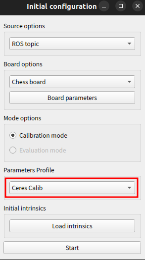
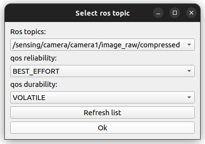
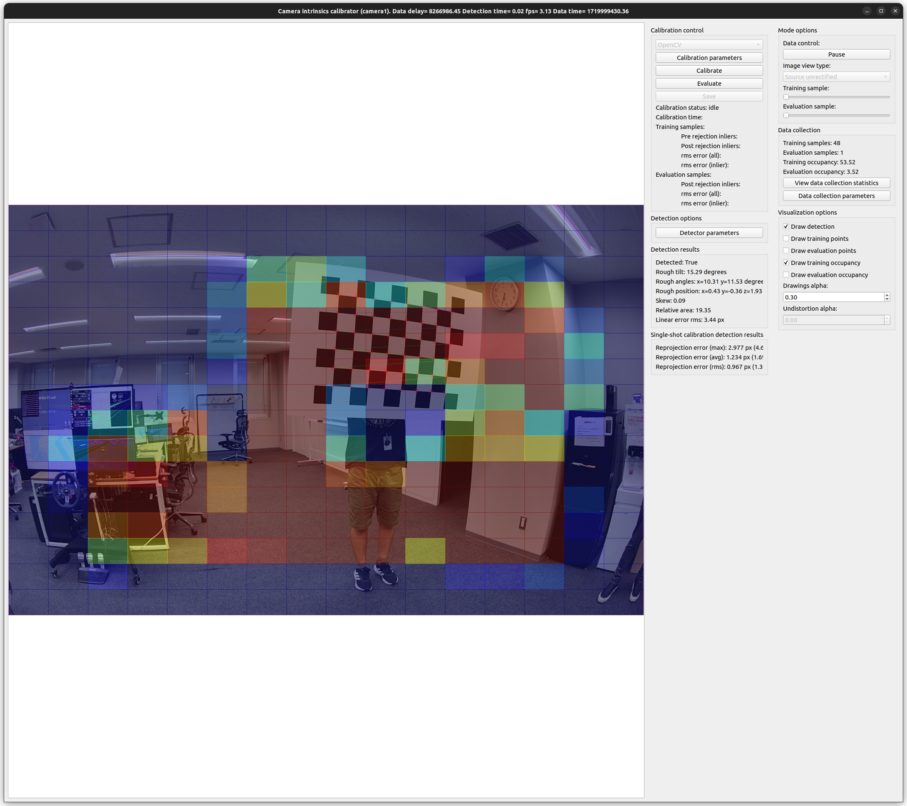
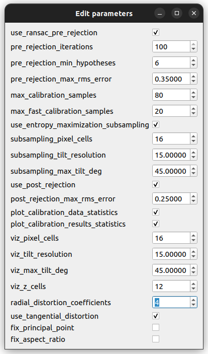
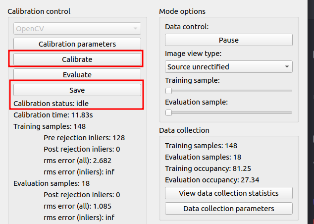
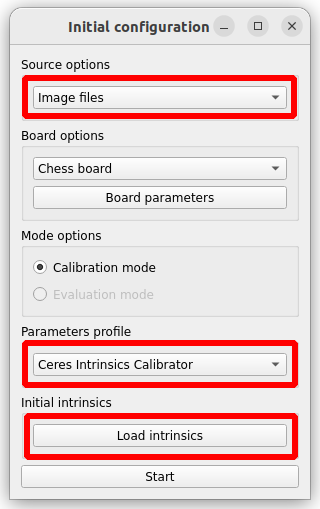
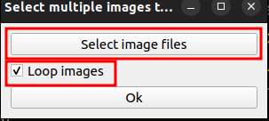
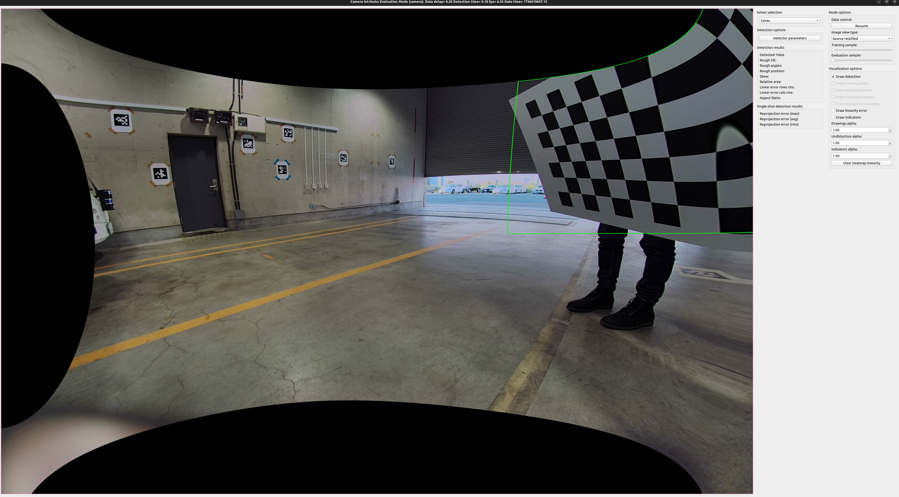
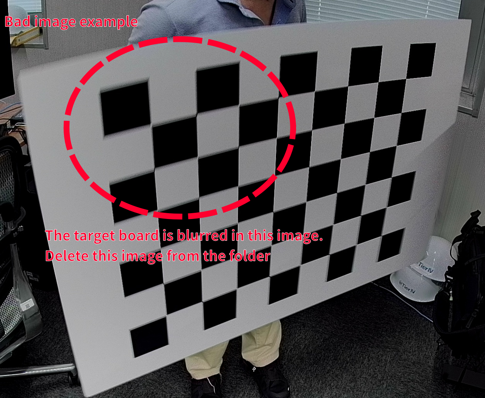

# Camera Intrinsic Calibration

This page describes the procedure for calibrating the internal parameters (focal length, principal point, and distortion) of the cameras.

Tool reference: [intrinsic_camera_calibrator.md](https://github.com/tier4/CalibrationTools/blob/feat/drs/docs/tutorials/intrinsic_camera_calibrator.md)

---

## 1. Preparation & Execution

Navigate to the appropriate directory based on your environment:
- **Docker environment**: `cd /opt/drs`
- **Local build environment**: `cd <cloned_calibration_tools_dir>`

> [!TIP]
> Ensure the sensor drivers are running on the ECUs (see [Sensor Check](sensor_check.md)).

**Terminal (Inside Calibration Container or Workspace):**

```bash
source ./install/setup.bash

# Run for C3-30 (camera0, camera4)
ros2 run intrinsic_camera_calibrator camera_calibrator \
  --config-file ./install/intrinsic_camera_calibrator/share/intrinsic_camera_calibrator/config/intrinsics_calibrator_c2_30.yaml

# Run for C2-120 and C3-120 (camera1, camera2, camera3, camera5, camera6, camera7)
ros2 run intrinsic_camera_calibrator camera_calibrator \
  --config-file ./install/intrinsic_camera_calibrator/share/intrinsic_camera_calibrator/config/intrinsics_calibrator_c2_120.yaml
```

---

## 2. Calibration Procedure

Follow these steps for each camera:

### Step 1: Initialization
1.  **First Dialog**:
    - **Source options**: `ROS topics`
    - **Board options**: `Chess board`
    - **Parameters Profile**: `Ceres Intrinsics Calibrator`
    - Click **Start**.  
    
2.  **Second Dialog**:
    - **Topic**: Select the target camera topic (e.g., `/sensing/camera/camera1/image_raw/compressed`).
    - **QoS Reliability**: `BEST_EFFORT`
    - **QoS Durability**: `VOLATILE`
    - Click **Ok**.  
    

### Step 2: Main Window Configuration
In the Main Window, adjust the following settings:  

1.  **Visualization options**:
    - Check **Draw training occupancy**.
    - Set **Drawings alpha** to `0.3`.
2.  **Calibration parameters**:
    Set the coefficients based on the camera's Field of View (FoV).

    | Camera Type | Radial Distortion | Rational Distortion |
    | :--- | :--- | :--- |
    | **30° (C3-30)** | `2` | `0` |
    | **120° (C2-120/C3-120)** | `3` | `3` |

    

### Step 3: Data Collection & Calculation
1.  **Move the Chessboard**: Move the board slowly to cover the entire field of view. Aim to turn all occupancy cells red.
2.  **Calibrate**: Click **Calibration control** > **Calibrate**.
3.  **Save Results**: Once status is "idle", click **Save**.
    - Select a directory (e.g., `/calib/camera<N>`).    
    

---

## 3. Evaluation & Refinement

### Step 1: Confirm the Result (Evaluation Mode)
1. Execute the tool again but select **Image files** in the first dialog.
2. Click **Load Intrinsics** and select the saved `*_info.yaml` at `/calib/camera<N>`.
3. Click **Start**.  
  
4. Select the all images in the `evaluation_images/` folder.
5. Check **Loop images** and click **Ok**.  
  
6. Set **Image view type** to `Source rectified`.
7. Set "Visualization options" > "Undistortion alpha" to `1.00`.
8. **Success Criteria**: The rectified image should look roughly symmetric. If it looks distorted (e.g., asymmetric X-shape), you need to refine the data.  
  
9. **Wrong image example**:  
  If a completely asymmetric result like the following is shown, there is a high possibility that intrinsic calibration went wrong. In that case, consider redoing the calibration process or refining data introduced in the next section.  
  

### Step 2: Refinement
If the results are poor:
1.  Inspect the `training_images` folder.
2.  **Remove Bad Samples**: Delete images with motion blur or where the board is not clearly detected.
  
3.  **Recalibrate**: Run the tool using **Image files** as the source, selecting the cleaned `training_images` folder, and repeat the calibration.

---

## 4. Applying the Results

### Step 1: Edit the YAML File
Open the saved `<camera_name>_info.yaml` and apply these manual changes:

```patch
--- ./<camera_name>_info.yaml.before
+++ ./<camera_name>_info.yaml.after
-camera_name: ''
+camera_name: 'camera0' # <- change to match the target camera name
```

**Camera Position Mapping:**

| Camera Name | Position | FoV |
| :--- | :--- | :--- |
| **camera0** | Front Narrow | 30° |
| **camera1** | Front Wide | 120° |
| **camera2** | Right Front | 120° |
| **camera3** | Right Rear | 120° |
| **camera4** | Rear Narrow | 30° |
| **camera5** | Rear Wide | 120° |
| **camera6** | Left Rear | 120° |
| **camera7** | Left Front | 120° |

### Step 2: Deploy to ECUs
Rename the finalized `<camera_name>_info.yaml` to `camera_info.yaml` and copy it to the appropriate location on the ECUs.

| Component | Destination Path |
| :--- | :--- |
| **Path** | `/opt/drs/config/params/camera<N>/camera_info.yaml` |

---

**Next Step**: [Camera-LiDAR extrinsic calibration](extrinsic_calibration.md)
