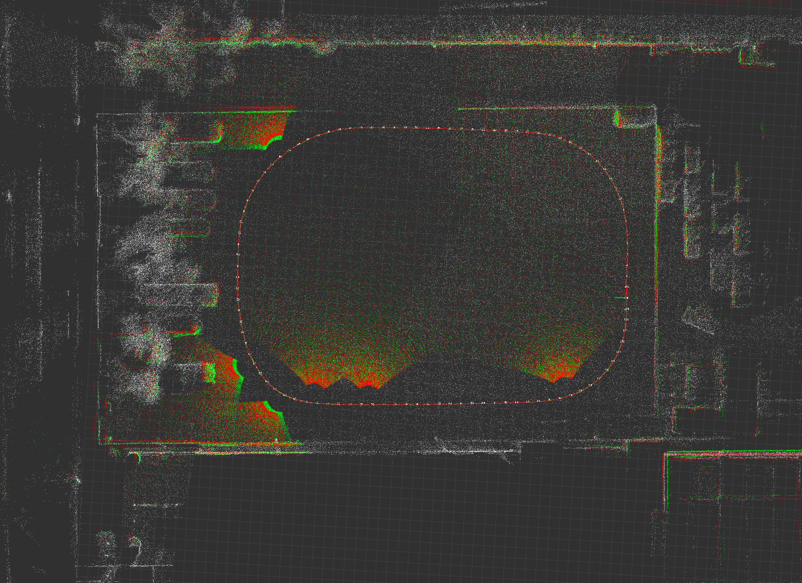
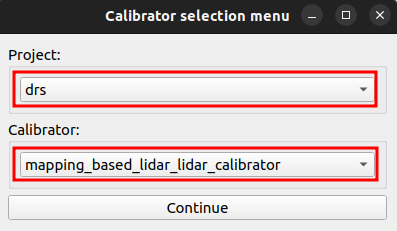
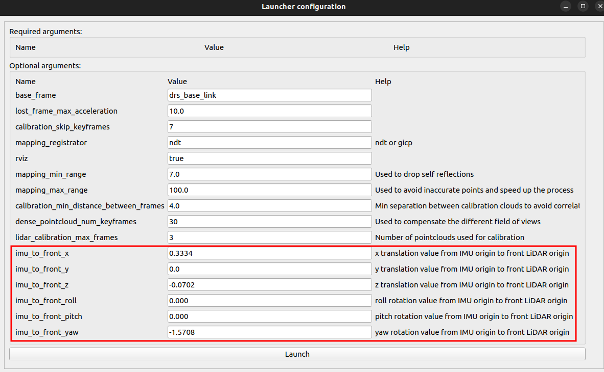
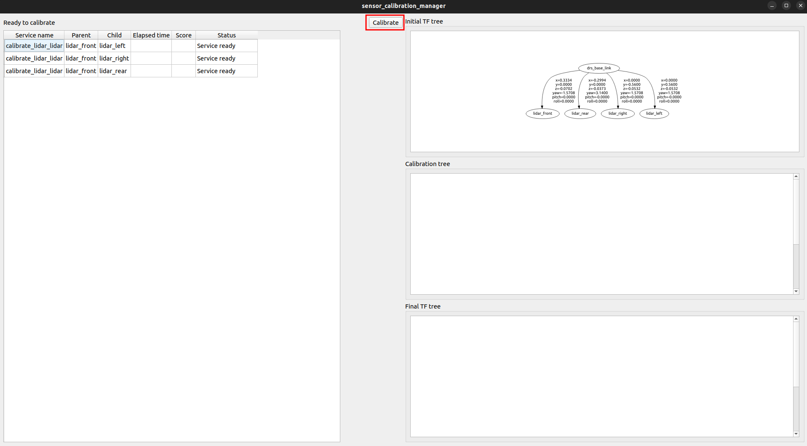
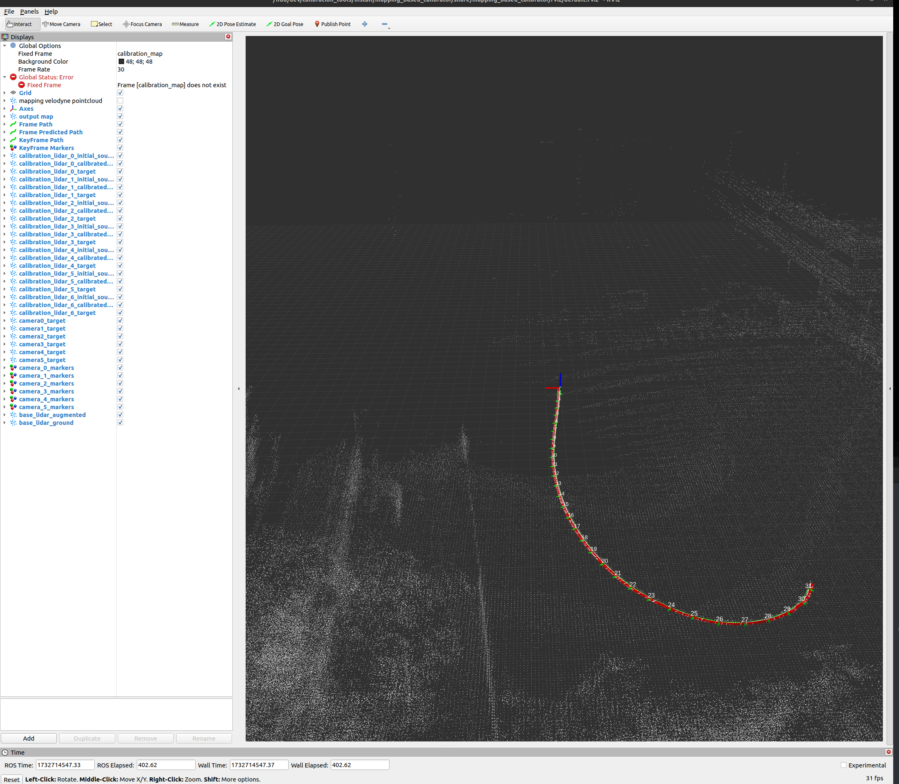
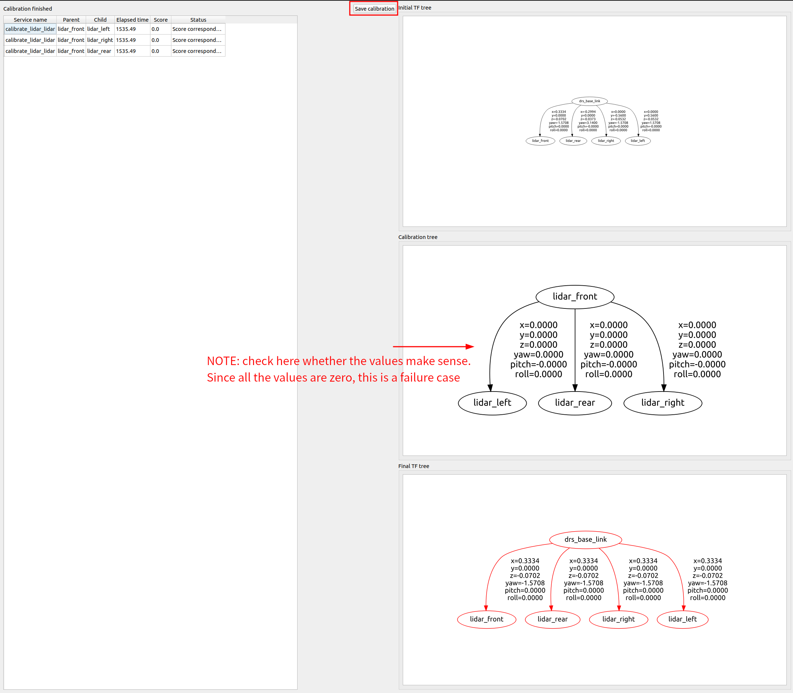

# LiDAR-LiDAR Calibration

This page describes the procedure for calibrating the relative pose between multiple LiDARs using a mapping-based approach.

Tool reference: [mapping_based_calibrator.md](https://github.com/tier4/CalibrationTools/blob/feat/drs/docs/tutorials/mapping_based_calibrator.md)

---

## 1. Data Collection (ECU Side)

The data collection process described below is assumed to be performed on ECU0 or ECU1 inside DRS.

1.  **Preparation**: Place the vehicle equipped with DRS in an open area. Having structures such as walls, pillars, or parked vehicles is better for feature matching. However, ensure that there are no moving people or vehicles in the surroundings. Moving objects in the surroundings will degrade the calibration accuracy.
2.  **Start Recording**:
    ```bash
    # SSH into an ECU (ECU0 or ECU1)
    # Record all LiDAR packet topics to an MCAP file at <ECU_BAG_PATH>
    ros2 bag record -s mcap \
      /sensing/lidar/front/nebula_packets \
      /sensing/lidar/right/nebula_packets \
      /sensing/lidar/rear/nebula_packets \
      /sensing/lidar/left/nebula_packets \
      -o <ECU_BAG_PATH>
    ```
    Depending on the driver used, the topic name may be `seyond_packets` instead of `nebula_packets`.
3.  **Drive Vehicle**: Drive in a **figure-eight or oval trajectory** to ensure all LiDARs capture overlapping features from different angles.
    -   Drive at a **low, constant speed** (~5 km/h).
    -   Avoid significant vehicle shaking from acceleration, deceleration, or road bumps.
    -   The start and end points must be closed; **overlap slightly** before stopping.
    
4. **Stop recording**: After completing one lap, press `Ctrl+C` to stop the rosbag recording.

> [!WARNING]
> It is recommended to collect 3 to 4 sets of data (3 to 4 MCAP files) in case the calibration fails in later steps.

---

## 2. Calibration Procedure (PC Side)

Process the recorded data on the calibration PC to compute the extrinsic parameters.

### Step 1: Launch Services
You need to run the decoder and the calibration manager in separate environments.

1.  **Terminal 1 (Runtime Container or Local Build Environment)**: Launch the LiDAR packet decoder.
    ```bash
    ros2 launch drs_launch drs_offline.launch.xml publish_tf:=false
    ```

    > [!NOTE]
    > If you are using the Seyond LiDAR driver, add the argument `lidar_driver_type:=seyond` to the launch command.
2.  **Terminal 2 (Calibration Container or Local Build Environment)**: Start the calibration manager.
    ```bash
    ros2 run sensor_calibration_manager sensor_calibration_manager
    ```

### Step 2: Configure the Tool
1.  **First Dialog**:
    - **Project**: Select `drs`.
    - **Calibrator**: Select `mapping_based_lidar_lidar_calibrator`.
    - Click **Continue**.  
    
2.  **Second Dialog**:
    - **Parameters**: Set the value of `imu_to_front_*` to the sensors' installation design. The values represent the origin pose of the front LiDAR in terms of INS origin.
    - Click **Launch**.
    
3.  **Third Dialog**:
    - Click **Calibrate**.
    

### Step 3: Play the Rosbag

1.  **Save Rosbag to PC**: Copy the Rosbag recorded in **1. Data Collection (ECU Side)** from the ECU to the calibration PC.
    ```bash
    # If the rosbag was saved on ECU0
    scp -r nvidia@192.168.20.1:<ECU_BAG_PATH> <PC_BAG_PATH>
    ```
2.  **Terminal 3 (Runtime Container or Local Build Environment)**: **Execute Playback**: Play the MCAP file on the PC.
    ```bash
    ros2 bag play <PC_BAG_PATH> --clock 100 -r 0.1
    ```
3.  **Wait**: The playback speed is set to `0.1x` to ensure the tool has enough time to process the packets. The tool automatically controls pausing and resuming. Keyframe positions should be seen/added on the RViz as the playback progresses.
    

---

## 3. Finalization

1.  **Terminal 3**: **Stop Mapping**: Once playback finishes, call the stop service to trigger the final alignment calculation.
    ```bash
    ros2 service call /stop_mapping std_srvs/srv/Empty
    ```
2.  **Wait for Alignment**: Monitor the terminal/UI for the "Alignment finished" status (**this may take 30+ minutes**).

3. **Save Results**: Once the alignment finishes, the **Save calibration** button will become available. Press it and save the result.
    

4. **Rename Result**: Rename the generated file to `lidar_calibration_results.yaml`.
    > [!NOTE]
    > In the next step, this result is used to create `multi_tf_static.yaml`. The expected directory structure for the results is as follows:
    > ```text
    > [temporary_directory]
    > ├── lidar_calibration_results.yaml
    > ├── camera0_calibration_results.yaml
    > ├── :
    > └── camera7_calibration_results.yaml
    > ```

---

**Next Step**: [Result integration and Application](result_integration.md)
