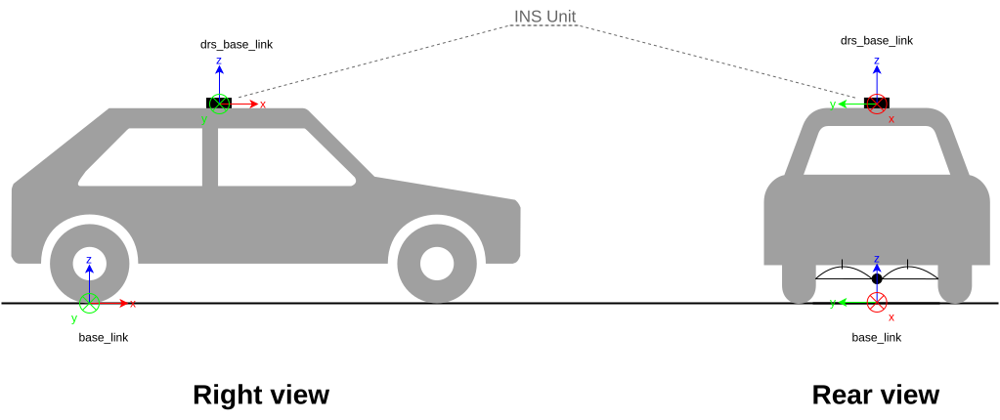

# Result Integration & Application

This page describes how to aggregate individual calibration results into a final configuration and deploy it to the vehicle ECUs.

---

## 1. Result Integration (PC Side)

After completing camera and LiDAR calibrations, you must merge the resulting YAML files into a single `multi_tf_static.yaml`.

### Step 1: Run the Aggregate Script

The DRS repository provides a script to collect all `*.yaml` results from a directory and generate a unified TF file.

```bash
# <RESULT_DIR> should contain:
# - camera<N>_calibration_results.yaml
# - lidar_calibration_results.yaml
python3 data_recording_system/scripts/aggregate_calibration_files.py <RESULT_DIR>
```

### Step 2: Manual TF Adjustment

The aggregated `multi_tf_static.yaml` contains sensor-to-sensor offsets. However, you must manually define the transformation from the vehicle's physical center (`base_link`) to the DRS mounting point (`drs_base_link`) using CAD or design values.

1.  Open the generated `multi_tf_static.yaml`.
2.  Locate the `base_link` to `drs_base_link` entry.
3.  **Update the values**: Replace the placeholder values with the actual offsets from your vehicle design.



### Step 3: Organize Files

Place the finalized `multi_tf_static.yaml` in the local configuration directory before deployment.

```bash
# Path: data_recording_system/src/individual_params/config/default/multi_tf_static.yaml
cp multi_tf_static.yaml data_recording_system/src/individual_params/config/default/
```

---

## 2. Deployment (ECU Side)

Now, apply the aggregated configuration and the individual camera/LiDAR parameters to both ECUs.

### Step 1: Transfer Files to ECUs

Copy the entire `default` configuration folder to the designated directory on each ECU.

:::tip
Always back up the existing configuration on the ECU before overwriting.
:::

**Deployment to ECU0 & ECU1:**
```bash
# Sync the individual_params/config/default directory to ECU0
rsync -avz ./data_recording_system/src/individual_params/config/default/ nvidia@192.168.20.1:/opt/drs/install/individual_params/share/individual_params/config/default/

# Sync the individual_params/config/default directory to ECU1
rsync -avz ./data_recording_system/src/individual_params/config/default/ nvidia@192.168.20.2:/opt/drs/install/individual_params/share/individual_params/config/default/
```

### Step 2: Apply Changes

Restart the sensor services on both ECUs to load the new calibration parameters.

```bash
# SSH into each ECU and run:
sudo systemctl restart drs-sensor.service
```

### Step 3: Final Verification
Launch the system on the PC and use RViz2 to verify that all TFs (Camera and LiDAR) are correctly aligned and match the vehicle's physical state.
