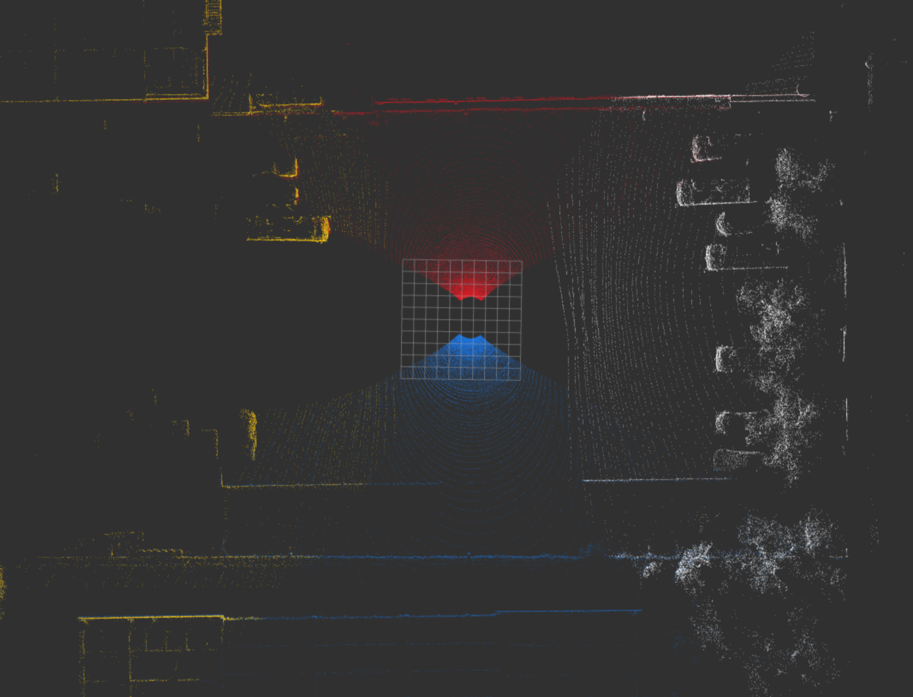
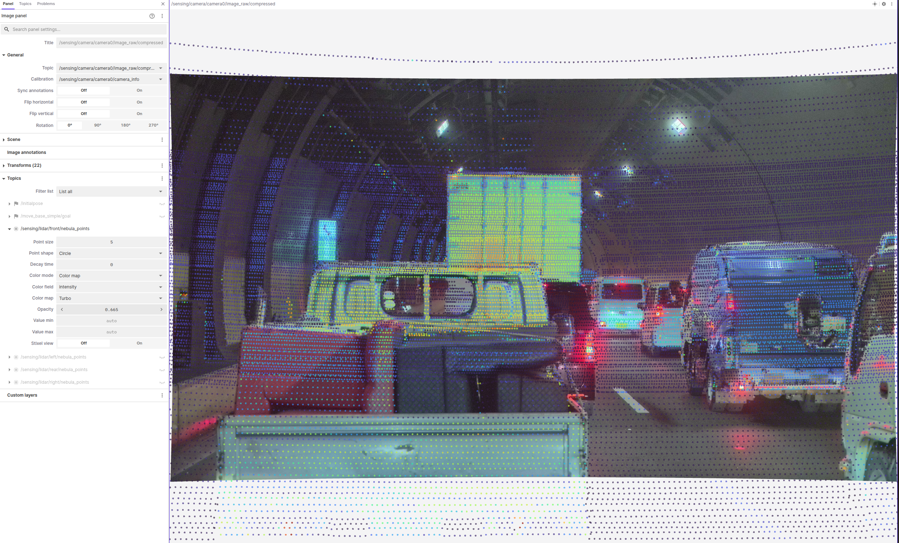

# Result Integration & Application

This page describes how to aggregate individual calibration results into a final configuration and deploy it to the vehicle ECUs.

---

## 1. Result Integration (PC Side)

After completing camera and LiDAR calibrations, you must merge the resulting YAML files into a single `multi_tf_static.yaml`.

### Step 1: Run the Aggregate Script

The DRS repository provides a script to collect all `*.yaml` results from a directory and generate a unified TF file.

```bash
# <temporary_directory> should contain:
# - camera<N>_calibration_results.yaml
# - lidar_calibration_results.yaml
python3 data_recording_system/scripts/aggregate_calibration_files.py <temporary_directory>
```

### Step 2: Manual TF Adjustment

The aggregated `multi_tf_static.yaml` contains sensor-to-sensor offsets. However, you must manually define the transformation from the vehicle's physical center (`base_link`) to the DRS mounting point (`drs_base_link`) using CAD or design values.

1.  Open the generated `multi_tf_static.yaml`.
2.  Locate the `base_link` to `drs_base_link` entry.
3.  **Update the values**: Replace the placeholder values with the actual offsets from your vehicle design.

    **Example**:
    ```yaml
    # Base link transform
    base_link:
      drs_base_link:
        x: 0.759
        y: 0.0
        z: 1.961
        roll: 0.0
        pitch: 0.0
        yaw: 0.0
    ```


---

## 2. Deployment (ECU Side)

Now, apply the aggregated configuration and the individual camera/LiDAR parameters to both ECUs.

### Step 1: Transfer Files to ECUs

Copy the aggregated `multi_tf_static.yaml` to the appropriate location on the ECUs.

| Component | Destination Path |
| :--- | :--- |
| **Path** | `/opt/drs/config/params/multi_tf_static.yaml` |

### Step 2: Apply Changes

Restart the sensor services on both ECUs to load the new calibration parameters.

```bash
# SSH into each ECU and run:
sudo systemctl restart drs-sensor.service
```

### Step 3: Final Verification

Launch the system on the PC and use Visualization Tool (RViz2, Lightblick/Foxglobe) to verify the following:

1.  **LiDAR Point Cloud Overlap**: Check that the point clouds from all LiDAR sensors are correctly overlaid without significant offsets.
    -   Display the environment in **Bird's-Eye View (BEV)**.
    -   Visualize point clouds from all four LiDARs simultaneously, ensuring each LiDAR's point cloud is **color-coded** differently for clarity.
    -   Focus on areas where the **Fields of View (FoV) overlap** and verify that objects (e.g., walls, poles, or ground features) do not show significant misalignment or "ghosting."

    
2.  **Camera-LiDAR Fusion**: Verify that the LiDAR point clouds are correctly projected onto the camera images for each camera.
    -   Display the LiDAR point cloud corresponding to the target camera image.
    -   Adjust **point cloud size** and **transparency** (alpha) in the visualization tool to make the overlay clearer.
    -   **Workflow Tips**:
        -   **Offline (rosbag)**: It is easiest to use **Lightblick** or **Foxglobe** to display rosbag data that has already been processed by the point cloud converter.
        -   **Online (Real-time)**: Launch the point cloud transformation node and the **rosbridge node** on **the PC**, then connect via **Lightblick** or **Foxglobe** for a more responsive verification.

            **For the point cloud transformation node**:
            ```bash
            # Launch Decoder (Runtime Container or Local Build Environment):
            # To decode nebula_packets
            ros2 launch drs_launch drs_offline.launch.xml publish_tf:=false

            # To decode seyond_packets
            ros2 launch drs_launch drs_offline.launch.xml publish_tf:=false lidar_driver_type:=seyond
            ```

            **For the rosbridge node**:
            ```bash
            # Launch rosbridge node (Runtime Container or Local Build Environment):
            ros2 launch rosbridge_server rosbridge_websocket_launch.xml
            ```
    -   Check for significant alignment errors between the image and the point cloud, as shown in the reference image below.

    

    **Camera-LiDAR Mapping Table:**

    Perform verification for each camera using the corresponding LiDAR data:

    | Camera ID | Position | Corresponding LiDAR |
    | :--- | :--- | :--- |
    | **camera0** | Front Narrow | `lidar_front` |
    | **camera1** | Front Wide | `lidar_front` |
    | **camera2** | Right Front | `lidar_right` |
    | **camera3** | Right Rear | `lidar_right` |
    | **camera4** | Rear Narrow | `lidar_rear` |
    | **camera5** | Rear Wide | `lidar_rear` |
    | **camera6** | Left Rear | `lidar_left` |
    | **camera7** | Left Front | `lidar_left` |
