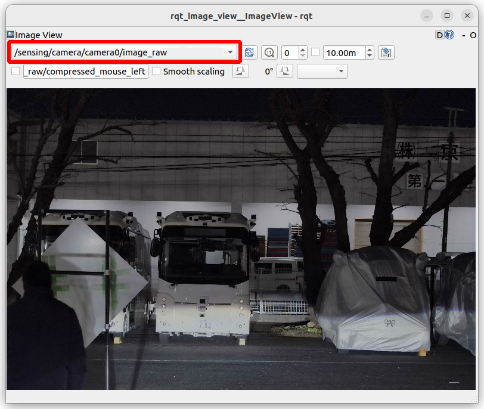
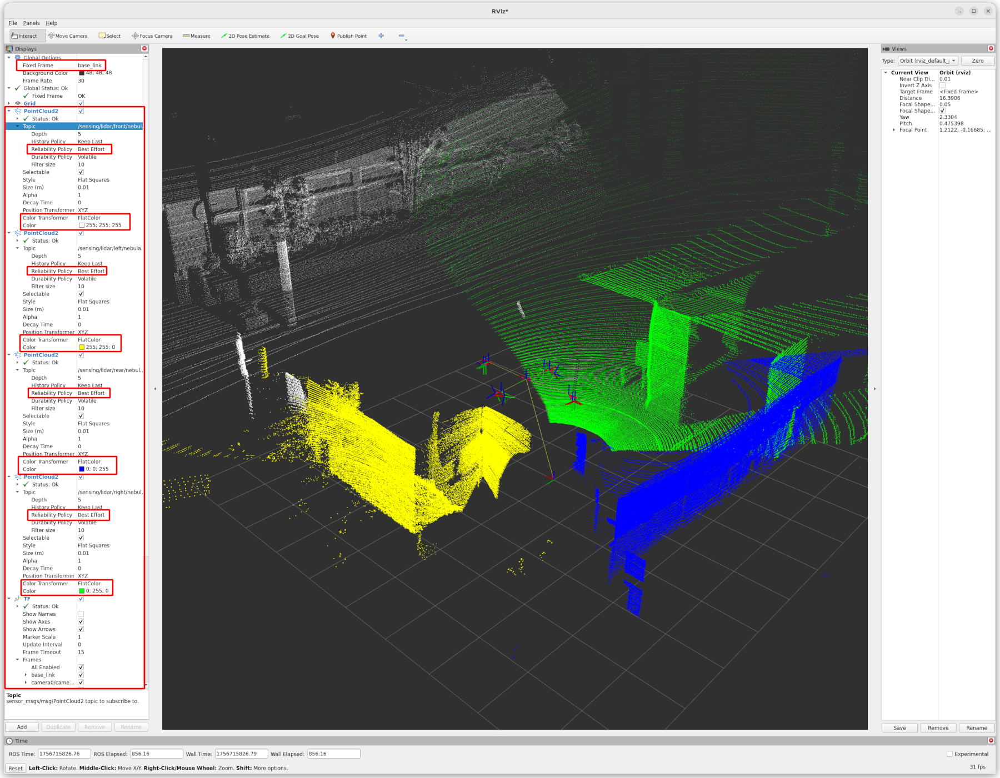

# Sensor operation check

Before starting the calibration process, verified that all sensors are functioning correctly and that their data is accessible from the calibration PC.

---

## 1. Camera Check

Verify that all 8 cameras (`camera0` to `camera7`) are streaming images correctly and match their physical positions.

### Step 1: Launch Drivers (ECU Side)

Connect to each ECU via SSH and start the sensor service.

| ECU | IP Address | Connected Cameras |
| :--- | :--- | :--- |
| **ECU0** | `192.168.20.1` | `camera0`, `camera1`, `camera2`, `camera3` |
| **ECU1** | `192.168.20.2` | `camera4`, `camera5`, `camera6`, `camera7` |

```bash
# SSH into the ECU
ssh nvidia@<ECU_IP_ADDRESS>

# Start the sensor service
sudo systemctl start drs-sensor.service
```

### Step 2: Visualize Images (PC Side)

On the calibration PC, use `rqt_image_view` to verify the streams.

:::tip
If you are using Docker, remember to run this command **inside the calibration container**.
:::

```bash
ros2 run rqt_image_view rqt_image_view
```

**Checklist:**
- [ ] **Image Stream**: An image is displayed correctly for each camera.
- [ ] **Topic Name**: Choose `/sensing/camera/camera<N>/image_raw` (not the compressed one).
- [ ] **Mapping**: The camera ID in the topic name corresponds to the physical mounting position on the vehicle.



---

## 2. LiDAR Check

Verify that all LiDARs are publishing point cloud data and their coordinate frames (TF) are correctly aligned.

### Step 1: Launch Drivers (ECU Side)

Connect to each ECU via SSH and start the sensor service if it is not already running.

| ECU | IP Address | Connected LiDARs |
| :--- | :--- | :--- |
| **ECU0** | `192.168.20.1` | `Front`, `Right` |
| **ECU1** | `192.168.20.2` | `Rear`, `Left` |

```bash
# SSH into the ECU
ssh nvidia@<ECU_IP_ADDRESS>

# Start the sensor service
sudo systemctl start drs-sensor.service
```

### Step 2: Launch Decoder (PC Side)

On the calibration PC, launch the point cloud decoder. If using Docker, run this in the **runtime container**.

```bash
# Enable TF publishing for visualization
ros2 launch drs_launch drs_offline.launch.xml publish_tf:=true
```

### Step 2: Visualize in RViz2 (PC Side)

Launch RViz2 and configure the displays.

```bash
rviz2
```

**Required RViz2 Configuration:**

1.  **Global Options**: Set `Fixed Frame` to `base_link`.
2.  **PointCloud2 Display**: Add a display for each LiDAR topic (e.g., `/sensing/lidar/front/nebula_points`).
    -   **Reliability Policy**: `Best Effort`
    -   **Color Transformer**: `FlatColor` (assign a different color to each LiDAR for easy identification).
3.  **TF Display**: Add a `TF` display to visualize the sensor frames.

**Checklist:**
- [ ] **Point Cloud Display**: Data is visible for each LiDAR.
- [ ] **Physical Matching**: The position of the point cloud in 3D space matches the physical mounting position.
- [ ] **TF Alignment**: The LiDAR frames are positioned correctly relative to `base_link`.



---

**Next Step**: [Camera intrinsic calibration](intrinsic_calibration.md)
