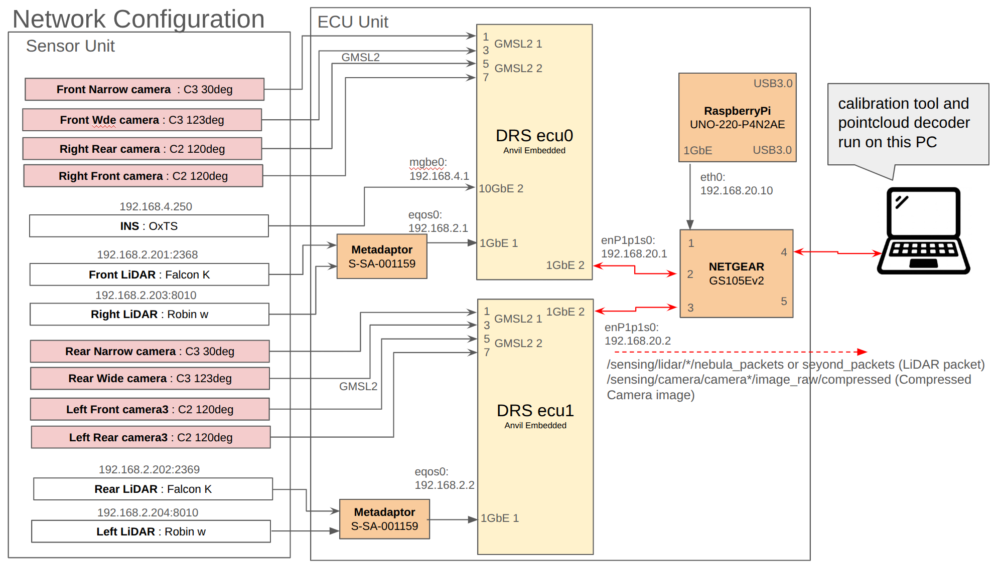

# Setup

This document describes how to set up the environment required for DRS sensor calibration.

## Network Architecture

It is assumed that sensor data (Camera/LiDAR) is delivered over ROS topics to a separate PC where the calibration tools are run.

-   **Physical Connection**: Use the right-most port of the Anvil ECUs.
-   **Static IP (PC Side)**: Configure your network interface with a static IP: `192.168.20.<X>/24` (where `<X>` is `3-255`).

> [!NOTE]
> The `192.168.20.<X>/24` network is where ECUs inside the DRS are connected. ECU0 is assigned `192.168.20.1`, ECU1 is assigned `192.168.20.2`, and in general, ECU<N> is assigned `192.168.20.<N>+1`. Therefore, assign an IP address to the PC's network interface that is not used by any other ECU.




---

## Environment Options

You can set up the environment using either **Docker** (recommended) or by **building from source**.

### Option 1: Using Docker (Recommended)

This method provides a pre-configured environment and is the easiest way to get started.

#### 1. Prerequisites

| Requirement | Description |
| :--- | :--- |
| **OS** | Ubuntu 22.04 |
| **Docker** | [Installation Guide](https://docs.docker.com/engine/install/ubuntu/) |
| **NVIDIA Container Toolkit** | [Installation Guide](https://docs.nvidia.com/datacenter/cloud-native/container-toolkit/latest/install-guide.html) |

**Confirmed Environment:**
- CPU: Core i7-11800H / RAM: 32GB / GPU: RTX 3060 Mobile

#### 2. Get the Source Code

```bash
git clone https://github.com/tier4/data_recording_system.git -b develop/r36.4.0
cd data_recording_system
```

#### 3. Configure DDS (CycloneDDS)

In order for the PC to communicate with the ECUs, you must specify the correct network interface name in the DDS configuration.

1.  Find your interface name (e.g., `enp1s0`) using `ip addr` command.
2.  Edit `docker/cyclonedds.xml`:

```xml
<!-- data_recording_system/docker/cyclonedds.xml -->
<NetworkInterface name="<YOUR_NETWORK_INTERFACE_NAME>" priority="default" multicast="default"/>
```

#### 4. Launch Containers

You will need two separate containers: one for runtime components and one for the calibration tool.

**Terminal 1: DRS Runtime Components**
```bash
# Start the runtime container to handle DRS components
./docker/runtime/run.sh \
  --option -v ./docker/cyclonedds.xml:/opt/drs/config/cyclonedds.xml \
  -- bash
```

**Terminal 2: Calibration Tool**
```bash
# Start the calibration container to handle calibration tools
# Replace <HOST_CALIB_DIR> with an absolute path on your PC (e.g., /home/user/drs_calib)
./docker/calibration/run.sh \
  --option -v <HOST_CALIB_DIR>:/calib \
  -v ./docker/cyclonedds.xml:/opt/drs/config/cyclonedds.xml \
  -- bash
```

> [!NOTE]
> The calibration results will be saved to the directory mounted at `/calib`. Ensure this directory `<HOST_CALIB_DIR>` exists on your host machine.

---

### Option 2: Building from Source

Use this option if you need to run the tools natively or customize the build.

> [!IMPORTANT]
> Some dependencies are hosted in private repositories. Ensure that your GitHub account has the necessary permissions to access these repositories.

#### 1. Prerequisites

| Requirement | Description |
| :--- | :--- |
| **OS** | Ubuntu 22.04 |
| **ROS** | ROS 2 Humble |
| **CUDA** | CUDA Toolkit 12.6 |
| **Middleware** | `sudo apt install ros-humble-rmw-cyclonedds-cpp` <BR> [DDS Settings](https://autowarefoundation.github.io/autoware-documentation/main/installation/additional-settings-for-developers/network-configuration/dds-settings/) |

#### 2. Install DRS Components

```bash
# Clone and import dependencies
git clone https://github.com/tier4/data_recording_system.git -b develop/r36.4.0
cd data_recording_system
mkdir src
vcs import src < drs.repos

# Install dependencies and build
rosdep install -y -r --from-paths `colcon list --packages-up-to drs_launch -p` --ignore-src
colcon build --symlink-install --cmake-args -DCMAKE_BUILD_TYPE=RelWithDebInfo --packages-up-to drs_launch
```

#### 3. Install Calibration Tools

```bash
git clone https://github.com/tier4/CalibrationTools.git -b feat/drs_202505 /opt/drs/src/calibration_tools
cd /opt/drs/src/calibration_tools
mkdir src
vcs import src < calibration_tools_standalone.repos

# Install dependencies and build
rosdep install -y -r --from-paths `colcon list --packages-up-to sensor_calibration_tools -p` --ignore-src
colcon build --symlink-install --cmake-args -DCMAKE_BUILD_TYPE=RelWithDebInfo --packages-up-to sensor_calibration_tools
```

#### 4. Environment Setup

Add the following to your `~/.bashrc`:

```bash
# Replace <CLONE_DIR> with the actual path
if [ -f <CLONE_DIR>/data_recording_system/install/setup.bash ]; then
    source <CLONE_DIR>/data_recording_system/install/setup.bash
fi
```

## Environment Verification

After setting up the environment, verify that ROS 2 is working correctly by listing the active topics.

> [!NOTE]
> If you are using Docker environment, perform this check inside both of the runtime and calibration containers.

```bash
ros2 topic list
```

If the system is working correctly, you should not see any error messages. If no other nodes are publishing data, you should see at least the following default topics:

```text
/parameter_events
/rosout
```

### Troubleshooting: "Communication Issues"

If `ros2 topic list` fails, the most common cause is a mismatch in the network interface specified in `cyclonedds.xml`.

**Resolution:**
1.  Verify your network interface name using `ip addr`.
2.  Ensure that the `<NetworkInterface name="..."/>` tag in `docker/cyclonedds.xml` (for Docker) or your DDS configuration file (for source builds) matches your actual interface name.
3.  Run `ros2 topic list` again to verify the connection.

---

**Next Step**: [Sensor operation check](sensor_check.md)
