# Setup

This document describes how to set up the environment required for DRS sensor calibration.

## Network Architecture

It is assumed that sensor data (Camera/LiDAR) is delivered over ROS topics to a separate PC where the calibration tools are run.

-   **Physical Connection**: Use the right-most port of the Anvil ECUs.
-   **Static IP (PC Side)**: Configure your network interface with a static IP: `192.168.20.<X>/24` (where `<X>` is `3-255`).



---

## Environment Options

You can set up the environment using either **Docker** (recommended) or by **building from source**.

### Option 1: Using Docker (Recommended)

This method provides a pre-configured environment and is the easiest way to get started.

#### 1. Prerequisites

| Requirement | Description |
| :--- | :--- |
| **OS** | Ubuntu 22.04 |
| **Docker** | [Installation Guide](https://docs.docker.com/engine/install/ubuntu/) |
| **NVIDIA Container Toolkit** | [Installation Guide](https://docs.nvidia.com/datacenter/cloud-native/container-toolkit/latest/install-guide.html) |

**Confirmed Environment:**
- CPU: Core i7-11800H / RAM: 32GB / GPU: RTX 3060 Mobile

#### 2. Get the Source Code

```bash
git clone https://github.com/tier4/data_recording_system.git -b develop/r36.4.0
cd data_recording_system
```

#### 3. Configure DDS (CycloneDDS)

Edit `docker/cyclonedds.xml` to match your network interface.

```xml
<!-- data_recording_system/docker/cyclonedds.xml -->
<NetworkInterface name="<YOUR_NETWORK_INTERFACE_NAME>"/> <!-- e.g., enp1s0 -->
```

#### 4. Launch Containers

You will need two separate containers: one for runtime components and one for the calibration tool.

:::tip
Replace `<CLONE_DIR>` with the absolute path to your `data_recording_system` directory.
:::

**Terminal 1: DRS Runtime Components**
```bash
./data_recording_system/docker/runtime/run.sh \
  --option -v <CLONE_DIR>/data_recording_system/docker/cyclonedds.xml:/opt/drs/config/cyclonedds.xml \
  -- bash
```

**Terminal 2: Calibration Tool**
```bash
./data_recording_system/docker/calibration/run.sh \
  --option -v <RESULT_SAVE_DIR>:/tmp/calib \
  -v <CLONE_DIR>/data_recording_system/docker/cyclonedds.xml:/opt/drs/config/cyclonedds.xml \
  -- bash
```

---

### Option 2: Building from Source

Use this option if you need to run the tools natively or customize the build.

#### 1. Prerequisites

| Requirement | Description |
| :--- | :--- |
| **OS** | Ubuntu 22.04 |
| **ROS** | ROS 2 Humble |
| **CUDA** | CUDA Toolkit 12.6 |
| **Middleware** | `sudo apt install ros-humble-rmw-cyclonedds-cpp` |

#### 2. Install DRS Components

```bash
# Clone and import dependencies
git clone https://github.com/tier4/data_recording_system.git -b develop/r36.4.0
cd data_recording_system
mkdir src
vcs import src < drs.repos

# Install dependencies and build
rosdep install -y -r --from-paths `colcon list --packages-up-to drs_launch -p` --ignore-src
colcon build --symlink-install --cmake-args -DCMAKE_BUILD_TYPE=RelWithDebInfo --packages-up-to drs_launch
```

#### 3. Install Calibration Tools

```bash
git clone https://github.com/tier4/CalibrationTools.git -b feat/drs_202505 /opt/drs/src/calibration_tools
cd /opt/drs/src/calibration_tools
mkdir src
vcs import src < calibration_tools_standalone.repos

# Install dependencies and build
rosdep install -y -r --from-paths `colcon list --packages-up-to sensor_calibration_tools -p` --ignore-src
colcon build --symlink-install --cmake-args -DCMAKE_BUILD_TYPE=RelWithDebInfo --packages-up-to sensor_calibration_tools
```

#### 4. Environment Setup

Add the following to your `~/.bashrc`:

```bash
# Replace <CLONE_DIR> with the actual path
if [ -f <CLONE_DIR>/data_recording_system/install/setup.bash ]; then
    source <CLONE_DIR>/data_recording_system/install/setup.bash
fi

---

**Next Step**: [Sensor operation check](sensor_check.md)
